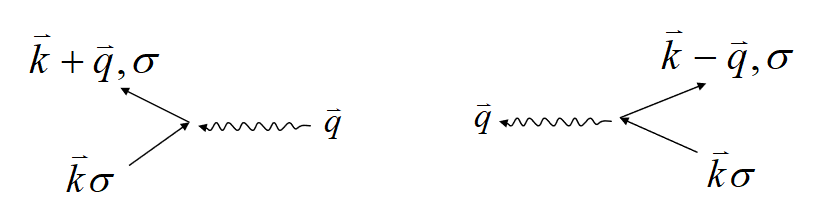

关于BCS理论的笔记，主要内容来源于谭志杰老师和熊锐老师固体物理2的ppt和李正中老师的《固体理论》

# 超导的BCS理论
## 一些背景
### 同位素效应
1950年，Maxwell等测量了Hg的几种同位素的$Tc$ ，发现临界转变温度和同位素原子质量有如下关系

$$T_cM^{1/2}=const$$

在其他材料中也存在这种现象，回忆固体物理中关于Debye模型的部分，我们在晶格动力学中有：

$$\omega_D\cdot M^{1/2}=const$$

其中$\omega_D$是Debye频率。两个公式的惊人的相似性让我们可以推导出：当$M\to\infty,T_C\to\infty$，超导态不存在；$M\to\infty,\omega_D\to\infty$，晶格振动不能发生。

很自然地，我们可以猜测：产生超导的原因是电子与晶格振动的相互作用，即电子-声子相互作用

### 电子-声子相互作用的物理图像

电子带负电，两个电子互相排斥，在晶体中，两个电子可通过与晶格振动作用而间接吸引，电子$e_1$ 吸引周围正离子（运动产生声子）向它靠拢,形成正电荷聚集区把附近的另一个电子$e_2$吸引过来。

$e_1$吸引周围正离子$\to$正电荷聚集$\to$吸引$e_2$，相当于两个电子的相互吸引，此过程中，首先晶格离子移动，产生新的晶格振动，而后此振动消失，相当于发射和吸收声子。整个过程可以描述为电子对通过交换声子而产生相互作用。但是这个并不是一个实过程（可以想象一个电子的运动确实很难有那么大的影响，否则Born-Oppenheimer近似就很难发挥作用了），所谓的声子只是电子运动而引起的晶格电子云极化（晶格畸变），因此可以引起另一个极化电子云附近的电子的响应。

## 电子-声子相互作用的哈密顿量

电子-声子相互作用的哈密顿量由三部分组成：单粒子能量，声子-电子相互作用能，电子-电子Coulomb排斥能，这部分的具体推导可以看[电子-声子相互作用](https://lfcdepression.github.io/notes/ep_inter)

$$H=H_0+H_1+u$$

### 单粒子能量项$H_0$

$$H_0=\sum_{\vec{k}\sigma}\varepsilon(\vec{k})C_{\vec{k}\sigma}^{\dagger}C_{\vec{k}\sigma}+\sum_{\vec{q}}\hbar\omega_{\vec{q}}a_{\vec{q}}^{\dagger}a_{\vec{q}}$$

对应于一个无相互作用的系统中，电子和声子的单粒子能量

### 电子和声子相互作用项$H_1$
电子吸收或发射一个声子，从波矢$\vec{k}$ 变为波矢 $\vec{k}+\vec{q}$

$$H_1=\sum_{\vec{q}\vec{k}\sigma}\left\lfloor D_{\vec{q}}C_{\vec{k}+\vec{q},\sigma}^{\dagger}C_{\vec{k}\sigma}a_{\vec{q}}+D_{-\vec{q}}C_{\vec{k}-\vec{q},\sigma}^{\dagger}C_{\vec{k}\sigma}a_{\vec{q}}^+\right\rfloor $$

式中$D_{\vec{q}}=i(\hbar/2M\omega_{\vec{q}})^{1/2}\mid\vec{q}\mid C,M$ 为原子质量，$C$ 为常数，$C\sim-2\varepsilon_F/3$

左图为波矢为$k$ 的电子吸收一个波矢为$\vec{q}$ 的声子，产生一个波矢为$\vec{k}+\vec{q}$ 的电子，同时，波矢为$\vec{k}$ 的电子，波矢为$\vec{q}$ 的声子被消灭。右图为波矢为$\vec{k}$ 的电子，放出一个波矢为$\vec{q}$ 的声子，变为波矢为$k-\vec{q}$ 的电子。同时波矢为$k$ 的电子被消灭。

### 电子-电子Coulomb排斥作用项$u$

$$u=\sum_{\vec{q}\vec{k}\vec{k}^{\prime}\sigma\sigma^{\prime}}\upsilon_{\vec{q}}C_{\vec{k}-\vec{q},\sigma}^{\dagger}C_{\vec{k}^{\prime}+\vec{q},\sigma^{\prime}}^{\dagger}C_{\vec{k}^{\prime},\sigma^{\prime}}C_{k\sigma}$$

波矢分别为$\vec{k}$ 和$\vec{k}^{\prime}$的一对电子由于Coulomb排斥，交换能量$\hbar\omega_{\vec{q}}$ 后分别处于波矢为$(\vec{k}-\vec{q})$和 $(\vec{k}+\vec{q})$ 的状态。式中$\upsilon_{\vec{q}}$为Coulomb势，应包括屏蔽效应，用一个介电函数描述。

### 对电子-声子哈密顿量的讨论
- 哈密顿量可以用于各种电子-声子相互作用的讨论
- $H$中包含反对易的电子算符，也包含对易的声子算符，在同一个式子中同时出现对易算符和反对易算符处理有困难
- 系统中声子总数不变（作用通过交换虚声子产生），因此声子自能可以忽略不计，哈密顿量第一项只需要考虑电子自能
- 声子电子相互作用项中，电子对通过交换虚声子间接作用，过程前后各种波矢的声子总数都不变，因此只涉及$H_1$中不包含声子算符的部分$H_{int}$
- $u$中不包含声子算符

因此，我们或许可以写出不包含声子算符的哈密顿量来描述超导体系。具体的操作过程参考[电子-声子相互作用](https://lfcdepression.github.io/notes/ep_inter)，使用中岛变换得到结果

$$H_{int}=\sum_{k,k^{\prime},q,\sigma,\sigma^{\prime}}\frac{\mid D_q\mid^2\hbar \omega_{\vec{q}}}{(\varepsilon_{\vec{k}}-\varepsilon_{\vec{k}+\vec{q}})^2-(\hbar\omega_{\vec{q}})^2}C_{\vec{k}+\vec{q},\sigma}^{\dagger} C_{\vec{k^{\prime}}-\vec{q},\sigma^{\prime}}^{\dagger}C_{\vec{k^{\prime}}\sigma^{\prime}}C_{\vec{k}\sigma}$$

电子-电子间接互作用可能是吸引，也可能是排斥，取决于$(\varepsilon_{\vec{k}}-\varepsilon_{\vec{k}+\vec{q}})^2-(\hbar\omega_{\vec{q}})^2$的符号

### 超导有效哈密顿量
- $H_T=H_0^e+H_{\mathrm{~int~}}+u$不包含声子算符
- 可以证明，只有波矢和自旋都相反的电子对交换声子产生的相互作用最强，因此我们只考虑这种情况

{:height="36px" width="16px"}

最后的超导哈密顿量可以写为

$$H_T=H_0^e+\sum_{\vec{k}\vec{k}^{\prime}}V_{\vec{k}\vec{k}^{\prime}}C_{\vec{k}^{\prime}}^{\dagger}C_{-\vec{k}^{\prime}}^{\dagger}C_{-\vec{k}}C_{\vec{k}}$$

式中

$$V_{\vec{k}\vec{k}^{\prime}}=\frac{2\mid D_q\mid^2\hbar \omega_{\vec{q}}}{(\varepsilon_{\vec{k}}-\varepsilon_{\vec{k}+\vec{q}})^2-(\hbar\omega_{\vec{q}})^2}+\upsilon_{\vec{k}-\vec{k'}}$$

前一项来自于间接相互作用，后一项来源于电子间的Coulomb排斥，当$V_{\vec{k}\vec{k}^{\prime}}<0$时为净吸引作用，电子结合成Cooper对，是超导态电子；当$V_{\vec{k}\vec{k}^{\prime}}>0$时，两电子排斥，是正常态电子。

## BCS理论

s

s
s
s
ss

s
s
s
s
s
s