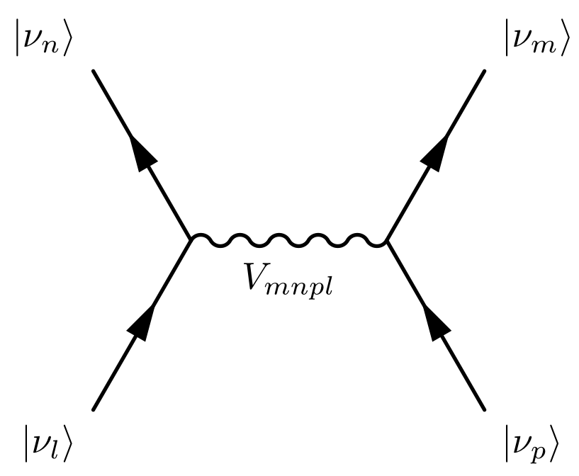
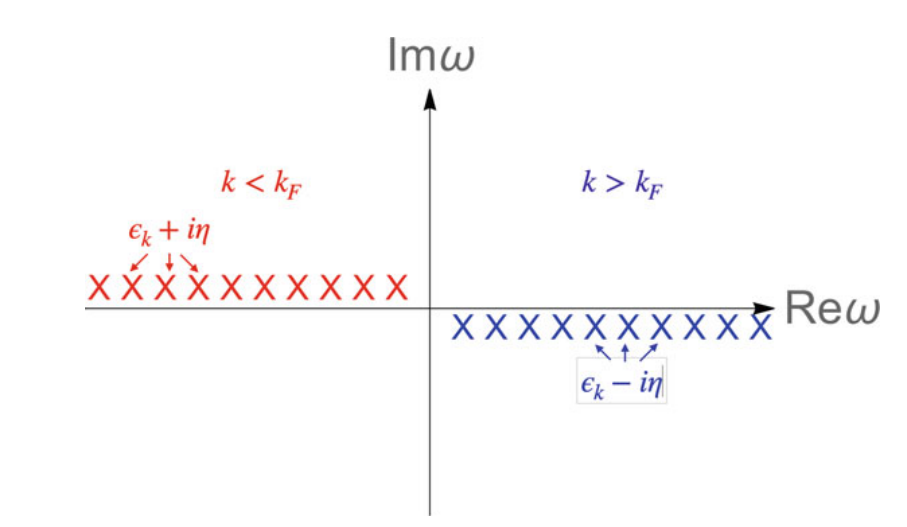
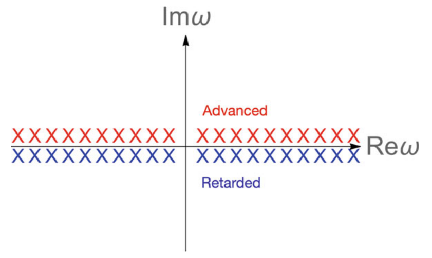
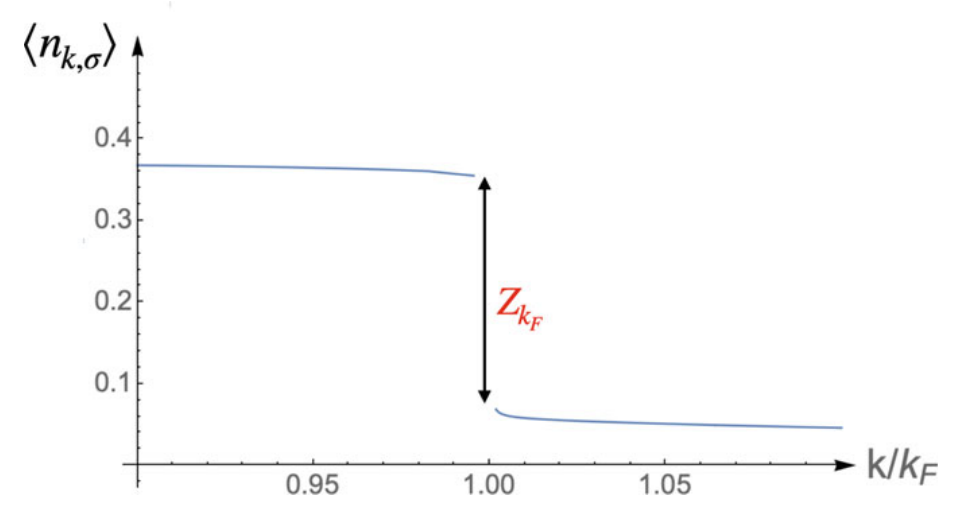

Jaime Merino , Alfredo Levy Yeyati"Many-Body Techniques in Condensed Matter Physics"学习笔记

## 目录
- [目录](#目录)
- [1 引子](#1-引子)
  - [1.1 金属模型](#11-金属模型)
  - [1.2 Hubbard Model](#12-hubbard-model)
  - [1.3 Heisenberg Model](#13-heisenberg-model)
  - [1.4 金属中磁性杂质的Anderson Model](#14-金属中磁性杂质的anderson-model)
- [2 Green函数方法](#2-green函数方法)
  - [2.1 时间演化](#21-时间演化)
  - [2.2 零温因果Green函数](#22-零温因果green函数)
  - [2.3 自由费米子的因果格林函数](#23-自由费米子的因果格林函数)
  - [2.4 物理可观测量](#24-物理可观测量)
  - [2.5 相互作用系统中格林函数的一般解析性质](#25-相互作用系统中格林函数的一般解析性质)
  - [2.6 推迟和超前格林函数](#26-推迟和超前格林函数)
  - [2.7 费米液体性质](#27-费米液体性质)
## 1 引子
### 1.1 金属模型

解决问题的一个最初步的思路是写出普适的多体哈密顿量：

$$\begin{equation*}
\begin{aligned}
    H=&\sum_I\frac{P_I^2}{2M}+\sum_i\frac{p_i^2}{2m}+\frac{(Ze)^2}{2}\sum_{I\neq J}\frac{1}{\vert \mathbf{R}_I-\mathbf{R}_J\vert }\\&+\frac{e^2}{2}\sum_{i\neq j}\frac{1}{\vert \mathbf{x}_i-\mathbf{x}_j\vert }-Ze^2\sum_{i,I}\frac{1}{\vert \mathbf{x}_i-\mathbf{R}_I\vert }
\end{aligned}
\end{equation*}$$

在这个巨大的Hilbert空间中对角化显然是困难的，我们可以根据需要处理的体系做出合理的近似，使用Born-Oppenheimer近似将电子与原子核之间的运动解耦（原子核的运动相对于电子问题而言可以忽略），因此我们可以单独处理电子哈密顿量，这是我们后续问题的起点：

$$H_{metal}=\sum_i\left[\frac{p_i^2}{2m}+\sum_IV_{e-ion}(\mathbf{x}_i-\mathbf{R}_I^{eq})\right]+\frac{e^2}2\sum_{i\neq j}\frac1{\vert \mathbf{x}_i-\mathbf{x}_j\vert }=H_{oe}+V_{ee} $$

使用场算符来重写上面的哈密顿量，我们可以得到：

$$H_{metal}=\sum\int d\mathbf{x}\Psi^{\dagger}(\mathbf{x})(-\frac{\hbar\nabla^{2}}{2m}+V_{e-ion}(\mathbf{x}))\Psi(\mathbf{x})+V_{ee}\\V_{ee}=\frac12\int d\mathbf{x}d\mathbf{x}^{\prime}\Psi^{\dagger}(\mathbf{x})\Psi^{\dagger}(\mathbf{x}^{\prime})\frac{e^{2}}{\vert \mathbf{x}-\mathbf{x}^{\prime}\vert }\Psi(\mathbf{x}^{\prime})\Psi(\mathbf{x}).$$

原则上，我们可以使用任何类型的完全正交基组来描述金属的传导电子，在哈密顿量中，单电子部分和相互作用部分可以写为：

$$H_{oe}=\sum_{lp}V_{lp}c_{l}^{\dagger}c_{p}\\V_{ee}=\frac12\sum_{mnlp}V_{mnpl}c_m^\dagger c_n^\dagger c_lc_p\delta_{\sigma_m\sigma_p}\delta_{\sigma_n\sigma_l}$$

其中单电子矩阵元为：

$$V_{lp}=\langle l\vert -\frac{\hbar^2\nabla^2}{2m}+V_{e-ion}(\mathbf{x})\vert p\rangle=\int d\mathbf{x}\phi_{l}^{*}(\mathbf{x})(-\frac{\hbar^2\nabla^2}{2m}+V_{e-ion}(\mathbf{x}))\phi_{p}(\mathbf{x})$$

以及双粒子（相互作用）矩阵元：

$$V_{mnpl}=\langle mn\vert \frac{e^2}{\vert \mathbf{x}-\mathbf{x}^{\prime}\vert }\vert pl\rangle=e^2\int d\mathbf{x}\int d\mathbf{x}^{\prime}\frac{\phi_m^*(\mathbf{x})\phi_n^*(\mathbf{x}^{\prime})\phi_l(\mathbf{x}^{\prime})\phi_p(\mathbf{x})}{\vert \mathbf{x}-\mathbf{x}^{\prime}\vert }\delta_{\sigma_m\sigma_p}\delta_{\sigma_n\sigma_l}$$

库仑矩阵元$V_{mnpl}$的费曼图如下：

### 1.2 Hubbard Model

我们已经介绍了电子相互作用气体的简化模型。现在我们考虑相互作用电子和晶格局部磁矩的模型，即Hubbard Model：

我们考虑一个原子晶格，由于原子波函数相对于晶格参数的空间延伸很小，电子几乎处于局域状态。因此，我们应该使用局域原子轨道作为合适的基组来描述该系统的能带结构。使用每个位置上的$1s$轨道，自然选取$\Psi_{1s,i}(\mathbf{x})=\phi_{1s}(\mathbf{x}-\mathbf{x}_{i})$为场算符的基底：

$$\Psi_{\sigma}^{\dagger}=\sum_{j}\phi_{1s}^{*}(\mathbf{x}-\mathbf{x}_{j})c_{j\sigma}^{\dagger}$$

使用场算符写哈密顿量，可以得到：

$$\begin{equation*}
\begin{aligned}
H=&\sum_{\alpha}\int d\mathbf{x}\Psi_{\alpha}^{\dagger}(\mathbf{x})h_{oe}(\mathbf{x})\Psi_{\alpha}(\mathbf{x})+\\&\frac{1}{2}\sum_{\alpha,\beta}\int d\mathbf{x}d\mathbf{x}^{\prime}\Psi_{\alpha}^{\dagger}(\mathbf{x})\Psi_{\beta}^{\dagger}(\mathbf{x}^{\prime})v_{ee}(\mathbf{x}-\mathbf{x}^{\prime})\Psi_{\beta}(\mathbf{x}^{\prime})\Psi_{\alpha}(\mathbf{x})
\end{aligned}
\end{equation*}$$

其中：

$$\begin{aligned}
 h_{oe}(\mathbf{x})=-\frac{\hbar^{2}\nabla^{2}}{2m}+V(\mathbf{x}) \\
v_{ee}(\mathbf{x}-\mathbf{x}^{\prime})=\frac{e^{2}}{\vert \mathbf{x}-\mathbf{x}^{\prime}\vert }
\end{aligned}$$

可以写出二次量子化形式的哈密顿量：

$$H=\sum_{\alpha}\int d\mathbf{x}T_{ij}c_{i\alpha}c_{j\alpha}+\frac{1}{2}\sum_{i,j,k,l;\alpha,\beta}\langle ij\vert v_{ee}\vert lk\rangle c_{i\alpha}^{\dagger}c_{j\beta}^{\dagger}c_{k\beta}c_{l\alpha}$$

矩阵元如下：

$$\begin{equation*}
\begin{aligned}
T_{ij} &=\langle i\vert h_{oe}\vert j\rangle=\int d\mathbf{x}\phi_{i}^{*}(\mathbf{x})h_{oe}(\mathbf{x})\phi_{j}(\mathbf{x})V_{ij,lk}\langle ij\vert v_{ee}\vert lk\rangle \\&
=\int d\mathbf{x}d\mathbf{x}'\phi_{i}^{*}(\mathbf{x})\phi_{l}(\mathbf{x})v_{ee}(\mathbf{x}-\mathbf{x}')\phi_{j}^{*}(\mathbf{x}')\phi_{k}(\mathbf{x}')
\end{aligned}
\end{equation*}$$

在最简单的 Hubbard 模型中，只保留最近邻位点之间的跳跃矩阵元素和给定位点上两个电子之间的库仑排斥力。在这种情况下，模型参数减少为：

$$T_{ij}=\begin{cases}\epsilon,&\text{if }i=j\\-t,&\text{if }i,j \text{ n.n.}\\0,&\text{otherwise}\end{cases}$$

且

$$V_{ij,lk}=\begin{cases}U,&\text{if }i=j=l=k\\0,&\text{otherwise}\end{cases}$$

在这些简化下，我们恢复了Hubbard模型：

$$H=\epsilon\sum_{j\sigma}c_{j\sigma}^{\dagger}c_{j\sigma}-t\sum_{\langle ij,\sigma\rangle}c_{i\sigma}c_{j\sigma}+U\sum_{j}n_{j\uparrow}n_{j\downarrow}$$

由于：

$$\frac{U}{2}\sum_{j,\sigma,\sigma'}c_{j\sigma}^\dagger c_{j\sigma'}^\dagger c_{j\sigma'}c_{j\sigma}=\frac{U}{2}\sum_{j}(c_{j\uparrow}^\dagger c_{j\downarrow'}^\dagger c_{j\downarrow}c_{j\uparrow}+c_{j\downarrow}^\dagger c_{j\uparrow'}^\dagger c_{j\uparrow}c_{j\downarrow})$$

因为 $c_{j\sigma}^2=0$（泡利不相容），这个看似简单的模型描述了半填充时的一个非常重要的物理现象：Mott transition。当$U\to 0$时，系统为半满带金属，在极限 $U>>t$ 下，电子局域化形成Mott绝缘体。目前1D Hubbard模型已经有严格解，但2D体系和3D体系无严格解。

### 1.3 Heisenberg Model

在Hubbard模型的 $U>>t$ 极限下，电子虚拟偏移到邻近位置会导致 AF exchange。因此，Mott局域态中的自旋自由度受 AF Heisenberg模型控制：

$$H_{Hubbard}\to H_{Heisenberg}=J\sum_{\langle ij\rangle}\mathbf{S}_{i}\cdot\mathbf{S}_{j}$$

其中 $J=\frac{4t^{2}}{U}>0$ 。自旋算符满足代数：

$$[S_{i}^{\alpha},S_{j}^{\beta}]=i \epsilon^{\alpha\beta\gamma}S_{i}^{\gamma}\delta_{ij}$$

这与标准玻色子对易关系不同，因为$S_{i}^{\gamma}$不是c数（c数（c-number）用来表示量子力学中可以交换相乘次序而结果不变的量（一般是标量），和对应的是q数，q数不满足乘法交换律，一般是算符。）

$$S^x=\frac{1}{2}\begin{pmatrix}0&1\\1&0\end{pmatrix},S^y=\frac{1}{2}\begin{pmatrix}0&-i\\i&0\end{pmatrix},S^z=\frac{1}{2}\begin{pmatrix}1&0\\0&-1\end{pmatrix}$$

也可以在这里定义升降算符：

$$S_{i}^{+}=S_{i}^{x}+iS_{i}^{y}\\S_{i}^{-}=S_{i}^{x}-iS_{i}^{y}$$

Heisenberg模型的广义版本可以描述交换各向异性：

$$H=\sum_{\langle ij\rangle}(J_{x}S_{i}^{x}S_{j}^{x}+J_{y}S_{i}^{y}S_{j}^{y}+J_{z}S_{i}^{z}S_{j}^{z})$$

由此可以推广出几个模型：
- **Anisotropic Heisenberg:** If $J_x=J_y=J_\perp\neq0\text{ and }J_z\neq0.$
- **Ising model:** If $J_x=J_y=0\text{ and }J_z\neq0.$
- **XY model:** If $J_x=J_v=J_\perp\neq0\text{ and }J_z=0.$

相同位置上的自旋表现为费米子。但不同位置上的自旋算子是可交换的，因此，自旋算符并不完全像费米子的产生和湮灭算子。由于自旋算符的对易关系复杂，即使是二次自旋哈密顿量（如Heisenberg模型）也很难求解。这与可以直接对角化的二次费米子哈密顿量形成对比。因此，自旋模型可以导致非常有趣的状态。一种奇异相是量子自旋液体，这是一种在零温度下发生在晶格上的反铁磁耦合自旋的磁无序状态。

### 1.4 金属中磁性杂质的Anderson Model

Hubbard模型和Heisenberg模型指的是晶格上均匀相互作用的电子和自旋系统。杂质模型指的是原子或磁矩浸没在均匀电子气中的系统。Hilbert空间由平面波 $\{\phi_{\mathbf{k}}(\mathbf{x})\}$ 组成，描述金属主体和局部原子轨道， $\phi_d(\mathbf{x})=\phi_d(\mathbf{x}-\mathbf{R}_n)$ 其中 $\mathbf{R}_n$描述原子中单个局部轨道$\{\phi_{\mathbf{k}}(\mathbf{x}),\phi_{d}(\mathbf{x})\}$，可以由此写出场算符：

$$\Psi_\sigma^+(\mathbf{x})=\sum_\mathbf{k}\phi_\mathbf{k}^*(\mathbf{x})c_{\mathbf{k}\sigma}^++\phi_d^*(\mathbf{x})c_{d\sigma}^+$$

可以写出二次量子化形式的哈密顿量：

$$\begin{equation*}
\begin{aligned}
H&=\sum_\sigma\int d\mathbf{x}\Psi_\sigma^\dagger(\mathbf{x})h_{oe}(\mathbf{x})\Psi_\sigma(\mathbf{x})\\&+\frac{1}{2}\sum_{\alpha\beta}\int d\mathbf{x}\int d\mathbf{x}^{\prime}\Psi_\alpha^\dagger(\mathbf{x})\Psi_\beta^\dagger(\mathbf{x}^{\prime})v_{ee}(\mathbf{x})\Psi_\beta(\mathbf{x}^{\prime})\Psi_\alpha(\mathbf{x})\end{aligned}
\end{equation*}$$

进而可以得到：

$$\begin{equation*}
\begin{aligned}H&=\sum_{\mathbf{k}\sigma}\epsilon_{\mathbf{k}}c_{\mathbf{k}\sigma}^{\dagger}c_{\mathbf{k}\sigma}+\sum_{\sigma}\epsilon_{d}c_{d\sigma}^{\dagger}c_{d\sigma}+\sum_{\mathbf{k},\mathbf{k}^{\prime} \sigma}V_{\mathbf{k},\mathbf{k}^{\prime}}c_{\mathbf{k}\sigma}^{\dagger}c_{\mathbf{k}^{\prime}\sigma}\\&+\sum_{\mathbf{k}d}(c_{\mathbf{k}\sigma}^{\dagger}c_{d\sigma}+c_{d\sigma}^{\dagger}c_{\mathbf{k}\sigma})+Un_{d\uparrow}n_{d\downarrow}\end{aligned}
\end{equation*}$$

其中：

$$\begin{aligned}\epsilon_{\mathbf{k}}&=\int d\mathbf{x}\phi_{\mathbf{k}}^{*}(\mathbf{x})(-\frac{\hbar^{2}}{2m}\nabla^{2}+V(\mathbf{x}))\phi_{\mathbf{k}}(\mathbf{x})\\V_{\mathbf{k},\mathbf{k}^{\prime}}&=\int d\mathbf{x}\phi_{\mathbf{k}}^{*}(\mathbf{x})(-\frac{\hbar^{2}}{2m}\nabla^{2}+V(\mathbf{x}))\phi_{\mathbf{k}}^{\prime}(\mathbf{x})\\U&=\int d\mathbf{x}\int d\mathbf{x}^{\prime}\vert \phi_{d}(\mathbf{x}-\mathbf{R}_{n})\vert ^{2}\frac{e^{2}}{\vert \mathbf{x}-\mathbf{x}^{\prime}\vert }\vert \phi_{d}(\mathbf{x}^{\prime}-\mathbf{R}_{n})\vert ^{2}\end{aligned}$$

因此 Anderson 模型只保留了杂质上的库仑排斥 $U$ ，虽然还有其他项，但 $U$ 的影响最大，因为 $d$ 轨道是模型中空间局域化效应最明显的轨道。$V_{\mathbf{kk}^{\prime}}$可以通过解决散射问题而被吸收到平面波基组中，因此可以在不改变相关物理的情况下将其删除。因此我们可以得到Anderson 模型的哈密顿量：

$$H_{AM}=\sum_{\mathbf{k}\sigma}\epsilon_{\mathbf{k}}c_{\mathbf{k}\sigma}^{\dagger}c_{\mathbf{k}\sigma}+\sum_{\sigma}\epsilon_{d}c_{d\sigma}^{\dagger}c_{d\sigma}+\sum_{\mathbf{k}\sigma}V_{\mathbf{k}\sigma}(c_{\mathbf{k}\sigma}^{\dagger}c_{d\sigma}+c.c.)+Un_{d\uparrow}n_{d\downarrow}$$

极限 $U>>t$ 下，Anderson 模型简化为近藤模型（Kondo Model），其内容如下：

$$\begin{equation*}
\begin{aligned}H_{KM}&=\sum_{\mathbf{k}\sigma}\epsilon_{\mathbf{k}}c_{\mathbf{k}\sigma}^{\dagger}c_{\mathbf{k}\sigma}+\sum_{\sigma}\epsilon_{d}n_{d\sigma}\\&+\sum_{\mathbf{k},\mathbf{k}^{\prime}}J_{\mathbf{k}\mathbf{k}^{\prime}}(S_{d}^{+}c_{\mathbf{k}\downarrow}c_{\mathbf{k}^{\prime}\uparrow}+S_{d}^{-}c_{\mathbf{k}\uparrow}^{\dagger}c_{\mathbf{k}^{\prime}\downarrow}+S_{d}^{z}(c_{\mathbf{k}\uparrow}c_{\mathbf{k}^{\prime}\uparrow}-c_{\mathbf{k}\downarrow}c_{\mathbf{k}^{\prime}\downarrow}))\end{aligned}
\end{equation*}$$

这是研究金属中磁性杂质的起点。Kondo意识到自旋翻转过程可以解释在含有稀磁杂质的金属中观察到的电阻最小值。

## 2 Green函数方法

体系过于庞大，因此我们不可能通过求解含时的薛定谔方程来处理体系

$$\left(-\frac{\hbar^2}{2m}\sum_j\nabla_j^2+\sum_{i<j}V_{e-e}(\mathbf{x}_i-\mathbf{x}_j)+\sum_jV(\mathbf{x}_j)\right)\Psi=i\hbar\frac{\partial\Psi}{\partial t}$$

此外，在实验中我们测量的都是系统的元激发，因此元激发是我们关注的性质。例如，在光电效应实验中，入射光子会导致电子从系统中弹出。$k,\omega$ 射出的电子的强度由下式近似给出：

$$I(\mathbf{k},\omega)\propto-ImG^R(\mathbf{k},\omega)$$

其中， $G^{R}(\mathbf{k},\omega)$ 是推迟格林函数的Fourier变换：

$$G^R(\mathbf{k},t,t')=G^R(\mathbf{k},t-t')=-i\theta(t-t')\langle\{\Psi_\mathbf{k}(t),\Psi_\mathbf{k}(t')\}\rangle $$

一般来说，我们还可以从以下形式的推迟响应函数中获得系统对小的外部势的响应：

$$\chi_{ij}=-i\theta(t-t')\langle[A_i(t),A_j(t')]\rangle $$

最终目标是得到与实验直接相关的格林函数，构建格林函数的基本构件是前面介绍的场算符。

### 2.1 时间演化

我们希望找到系统随时间的演变，以便能够估计格林函数。这里的主要目标是找到场算符本身随时间的变化。我们首先回顾一下单粒子量子力学中系统随时间演变的不同方法，这些方法在形式上是等价的：

**Schrödinger picture**

在时间  $t$ 处的可观测量的平均值如下：

$$\langle O_s(t)\rangle=\langle\Psi_s(t)\vert O_s\vert \Psi_s(t)\rangle=\langle\Psi_s(t_0)\vert e^{iH(t-t_0)}O_se^{-iH(t-t_0)}\vert \Psi_s(t_0)\rangle $$

**Heisenberg picture**

对状态和可观测量做幺正演化：

$$\begin{aligned}\vert \Psi_{H}\rangle&\equiv e^{iH(t-t_{0})}\vert \Psi_{s}(t)\rangle=\vert \Psi_{s}(t_{0})\rangle\\O_{H}(t)&=e^{iH(t-t_{0})}O_{s}e^{-iH(t-t_{0})}\end{aligned}$$

我们不再使用Schrödinger的运动方程，而是使用Heisenberg的运动方程：

$$i\frac d{dt}O_H(t)=i^2He^{iH(t-t_0)}O_se^{-iH(t-t_0)}+e^{iH(t-t_0)}O_S(-i^2H)e^{-iH(t-t_0)}$$

或者等价地可以写：

$$i \frac{d}{dt}O_{H}=[O_{H},H]$$

其中 $O_{H}(t_{0})=O_{s}$。

### 2.2 零温因果Green函数

在量子场论中，单粒子格林函数是表征系统微观性质的基本量。其定义为：

$$G_{\alpha\beta}(x,x^{\prime})\equiv-i\langle T[\Psi_{H\alpha}(x)\Psi_{H\beta}^{\dagger}(x^{\prime})]\rangle $$

其中 $x=(\mathbf{x},t) , x'=(\mathbf{x}',t')$ 且 $\alpha , \beta$ 是自旋。目前我们假设 $T=0$ 平均是 $\langle\rangle=\langle{\Psi_{G}\vert \Psi_{G}\rangle}$，费曼在粒子物理学中引入的这些格林函数被称为时间有序或因果格林函数，并且可进行微扰展开。它们与分析 ARPES 实验直接相关。

时间顺序的定义是：

$$\begin{aligned}T[\Psi_{\alpha}^{H}(\mathbf{x},t)\Psi_{\beta}^{H}(\mathbf{x}^{\prime},t^{\prime}))]&=\Psi_{H\alpha}(\mathbf{x},t)\Psi_{H\beta}^{\dagger}(\mathbf{x}^{\prime},t^{\prime})\theta(t-t^{\prime})\\&\pm\Psi_{H\beta}^{\dagger}(\mathbf{x}^{\prime},t^{\prime})\Psi_{H\alpha}(\mathbf{x},t)\theta(t^{\prime}-t)\end{aligned}$$

$+$ 代表玻色子，$-$ 代表费米子，上式代表 $\mathbf{x}^{\prime}, t^{\prime}$ 时的源，在 $\mathbf{x},t$ 发现的概率，表示电子或者空穴的传播。我们开始更改记号以便后续处理，$\Psi^H(x)\to\Psi(x)\mathrm,G_{\alpha\beta}=G\delta_{\alpha\beta}$ 是自旋指标中的对角线。我们将考虑费米子和玻色子，对于玻色子，仅考虑为发生玻色凝聚的玻色子。

我们将主要处理时间上均匀且空间无限的系统，这些系统仅依赖于空间坐标差 $x − x'$ 和时间差 $t − t'$ 。因此，我们可以将格林函数表示为傅里叶积分：

$$\begin{gathered}
G(x,x^{\prime}) =G(x-x')=G(\mathbf{x}-\mathbf{x}',t-t')=\int\frac{d^{4}k}{(2\pi)^{4}}e^{ik(x-x')}G(k) \\
=\int\frac{d\mathbf{k}}{(2\pi)^3}\int\frac{d\omega}{(2\pi)}e^{i[\mathbf{k}(\mathbf{x}-\mathbf{x}^{\prime})-\omega(t-t^{\prime})]}G(\mathbf{k},\omega). 
\end{gathered}$$

最后，动量相关的格林函数为：

$$G(\mathbf{k},t-t')=\int\frac{d\omega}{2\pi}G(\mathbf{k},\omega)e^{-i\omega(t-t')}$$

### 2.3 自由费米子的因果格林函数

我们考虑自由费米子气体中的格林函数：

$$H=H^{0}-\mu N=\sum_{\mathbf{k},\sigma}\epsilon_{\mathbf{k}}c_{\mathbf{k}\sigma}^{\dagger}c_{\mathbf{k}\sigma}$$

$\epsilon_{\mathbf{k}}=\epsilon_{\mathbf{k}}^{0}-\mu$ ，哈密顿量在巨正则系综中表示。 求解$c_{\mathbf{k}\sigma}(t)$ 的Heisenberg运动方程，我们得到

$$\begin{aligned}
i \frac{\partial}{\partial t}c_{\mathbf{k}\sigma}(t)& =[c_{\mathbf{k}\sigma}(t),H]=e^{iHt}c_{\mathbf{k}\sigma}e^{-iHt}H-He^{iHt}c_{\mathbf{k}\sigma}e^{-iHt} \\
&=e^{iHt}[c_{\mathbf{k}\sigma},H]e^{-iHt}=\epsilon_{\mathbf{k}}c_{\mathbf{k}\sigma}(t),
\end{aligned}$$

又由于$[c_{\mathbf{k}\sigma},H]=\epsilon_{\mathbf{k}}c_{\mathbf{k}\sigma}$ ，得到解：

$$\begin{aligned}
c_{\mathbf{k}\sigma}(t)&=e^{-i\epsilon_{\mathbf{k}}t}c_{\mathbf{k}\sigma}\\c_{\mathbf{k}\sigma}^{\dagger}(t)&=e^{i\epsilon_{\mathbf{k}}t}c_{\mathbf{k}\sigma}^{\dagger}
\end{aligned}$$

现在在格林函数的定义中引入这个与时间相关的算子。对于 $t > t'$（向前传播过程），我们有：

$$G_{\sigma\sigma^{\prime}}(\mathbf{k},t-t^{\prime})=-i\langle\Psi_{G}\vert c_{\mathbf{k}\sigma}(t)c_{\mathbf{k}\sigma^{\prime}}^{\dagger}(t^{\prime})\vert \Psi_{G}\rangle=-ie^{-i\epsilon_{\mathbf{k}}(t-t^{\prime})}\langle\Psi_{G}\vert c_{\mathbf{k}\sigma}c_{\mathbf{k}\sigma^{\prime}}^{\dagger}\vert \Psi_{G}\rangle\\=-ie^{-i\epsilon_{\mathbf{k}}(t-t^{\prime})}\delta_{\sigma\sigma^{\prime}}(1-\langle n_{\mathbf{k}\sigma}\rangle)$$

其中有 $\vert \Psi_{G}\rangle=\prod_{\vert \mathbf{k}^{\prime}\vert <k_{F}}c_{\mathbf{k}^{\prime}\sigma}^{\dagger}\vert 0\rangle$ 和 $\langle n_{\mathbf{k}\sigma}\rangle=\langle\Psi_{G}\vert n_{\mathbf{k}\sigma}\vert \Psi_{G}\rangle=\theta(k_{F}-\vert \mathbf{k}\vert )$ ，同理可以得到 $t<t^{\prime}$ 的反向格林函数：

$$G_{\sigma\sigma^{\prime}}(\mathbf{k},t-t^{\prime})=-i\langle\Psi_{G}\vert c_{\mathbf{k}\sigma}(t)c_{\mathbf{k}\sigma^{\prime}}^{\dagger}(t^{\prime})\vert \Psi_{G}\rangle=ie^{-i\epsilon_{\mathbf{k}}(t-t^{\prime})}\delta_{\sigma\sigma^{\prime}}\langle n_{\mathbf{k}\sigma}\rangle $$

总结有：

$$G_\sigma(\mathbf{k},t)=-i(\theta(k-k_F)\theta(t)e^{-i\epsilon_\mathbf{k}t}-\theta(k_F-k)\theta(-t)e^{i\epsilon_\mathbf{k}t})$$

通过傅里叶变换可以得到频率分解：

$$G(\mathbf{k},\omega)=-i\{\theta(k-k_F)\int\limits_{-\infty}^\infty\theta(t)e^{i(\omega-\epsilon_\mathbf{k})t}dt-\theta(k_F-k)\int\limits_{-\infty}^\infty\theta(-t)e^{-i(\omega-\epsilon_\mathbf{k})t}dt\}$$

我们可以进行时间积分：

$$\lim\limits_{\eta\to0^+}\int\limits_0^\infty e^{i(\omega-\epsilon_\mathbf{k}+i\eta)t}dt=\frac{1}{i(i\eta+(\omega-\epsilon_\mathbf{k}))}e^{-\eta t}e^{i(\omega-\epsilon_\mathbf{k})t}\vert _0^\infty=i\lim\limits_{\eta\to0^+}\frac{1}{\omega-\epsilon_\mathbf{k}+i\eta}$$

我们最终得到 $G(\mathbf{k},\omega)$ 的结果：

$$G(\mathbf{k},\omega)=\frac{\theta(k-k_F)}{\omega-\epsilon_\mathbf{k}+i\eta}+\frac{\theta(k_F-k)}{\omega-\epsilon_\mathbf{k}-i\eta}=\frac{1}{\omega-\epsilon_\mathbf{k}+i\eta sign(k-k_F)}$$

在 $\omega$ 的复平面上有简单极点，$\omega=\epsilon_{\mathbf{k}}+i\eta \mathrm{~for~} k<k_{F} \mathrm{(holes)}$，和 $\omega=\epsilon_{\mathbf{k}}-i\eta \mathrm{~for~} k>k_{F} \mathrm{(electrons)}$ 。

### 2.4 物理可观测量

我们可以从格林函数中获得各种物理量，例如：

- 1. 单电子算符的平均值 
  
- 2. 基态能量
  
- 3. 系统的单电子激发

例如1，我们有：

$$\langle n(\mathbf{x})\rangle=\sum_{\sigma}\langle\Psi_{\sigma}^{\dagger}(\mathbf{x})\Psi_{\sigma}(\mathbf{x})\rangle=-\sum_{\sigma}\langle\Psi_{G}\vert T[\Psi_{\sigma}(\mathbf{x},0)\Psi_{\sigma}(\mathbf{x}^{\prime},0^{+})]\vert \Psi_{G}\rangle\vert _{\mathbf{x}^{\prime}\to\mathbf{x}}=\\-i(2S+1)G(\mathbf{x},0^{-})\vert _{\mathbf{x}=0}=-i(2S+1)\lim_{\mathbf{x}^{\prime}\to\mathbf{x},t^{\prime}\to t+0^{+}}G(\mathbf{x}-\mathbf{x}^{\prime},t-t^{\prime})$$

动能是：

$$\langle T(\mathbf{x})\rangle=\sum_{\sigma}\langle\Psi_{\sigma}^{\dagger}(\mathbf{x})(-\frac{n}{2m}\nabla_{x}^{2}\Psi_{\sigma}(\mathbf{x})\rangle=\frac{n}{2m}\nabla_{x}^{2}\sum_{\sigma}\langle T[\Psi_{\sigma}^{\dagger}(\mathbf{x})\Psi_{\sigma}(\mathbf{x})]\rangle=\\i(2S+1)\frac{\hbar^{2}\nabla_{x}^{2}}{2m}G(\mathbf{x}-\mathbf{x}^{\prime},t-t^{\prime})\vert _{\mathbf{x}^{\prime}\to\mathbf{x},t^{\prime}\to t+0^{+}}=i(2S+1)\frac{\hbar^{2}\nabla_{x}^{2}}{2m}G(\mathbf{x},0^{-})\vert _{\mathbf{x}=0}$$

### 2.5 相互作用系统中格林函数的一般解析性质

现在我们来考虑多粒子相互作用系统的因果格林函数的性质。我们提取格林函数的一般解析性质，而不对粒子相互作用的性质做出假设。我们将提供因果格林函数和与实验相关的延迟格林函数之间的一般关系。

一般相互作用费米子系统的因果格林函数如下：

$$\begin{aligned}G_{\alpha\beta}(x,x')&=-i\langle T[\Psi_{\sigma}^{\dagger}(\mathbf{x})\Psi_{\sigma}(\mathbf{x})]\rangle\\&=-i\{\theta(t-t^{\prime})\langle\Psi_{\alpha}(x)\Psi_{\beta}^{\dagger}(x^{\prime})\rangle-\theta(t-t^{\prime})\langle\Psi_{\beta}^{\dagger}(x^{\prime})\Psi_{\alpha}(x)\rangle\}\end{aligned}$$

引入一个完全的正交基，{$\vert n\rangle$}，对于粒子数不确定的完整哈密顿量，我们有：

$$\begin{aligned}
&G_{\alpha\beta}(\mathbf{x},t;\mathbf{x}^{\prime},t^{\prime})\\&=-i\sum_{n}(\theta(t-t^{\prime})\langle\Psi_{G}(N)\vert e^{iHt}\Psi_{\alpha}(\mathbf{x})e^{-iHt}\vert \Psi_{n}\rangle \times\langle\Psi_{n}\vert e^{iHt^{\prime}}\Psi_{\beta}^{\dagger}(\mathbf{x}^{\prime})e^{-iHt^{\prime}}\vert \Psi_{G}(N)\rangle \\
&-\theta(t'-t)\langle\Psi_{G}(N)\vert e^{iHt}\Psi_{\beta}^{\dagger}(\mathbf{x}')e^{-iHt}\vert \Psi_{n}\rangle\langle\Psi_{n}\vert e^{iHt}\Psi_{\alpha}(\mathbf{x})e^{-iHt}\vert \Psi_{G}(N)\rangle) \\
&=- i\sum_{n}(\theta(t-t^{\prime})e^{-i(E_{n}-E_{G}(N))(t-t^{\prime})}\langle\Psi_{G}(N)\vert \Psi_{\alpha}(\mathbf{x})\vert \Psi_{n}\rangle\langle\Psi_{n}\vert \Psi_{\beta}^{\dagger}(\mathbf{x}^{\prime})\vert \Psi_{G}(N)\rangle \\
&-\theta(t^{\prime}-t)e^{i(E-E_{G}(N))(t-t^{\prime})}\langle\Psi_{G}(N)\vert \Psi_{\beta}^{\dagger}(\mathbf{x}^{\prime})\vert \Psi_{n}\rangle\langle\Psi_{n}\vert \Psi_{\alpha}(\mathbf{x})\vert \Psi_{G}(N)\rangle)
\end{aligned}$$

由于：

$$N\psi_\beta(\mathbf{x})\vert \Psi_G(N)\rangle=(N-1)\psi_\beta(\mathbf{x})\vert \Psi_G(N)\rangle $$

矩阵元 $\langle\Psi_G(N)\vert \Psi_\beta^\dagger(\mathbf{x}^{\prime})\vert \Psi_n\rangle$ 非0，当$\left\vert \Psi_{n}\right\rangle$ 在$N-1$粒子区域，在平移对称的情况下，我们有：

$$\Psi_{\alpha}(\mathbf{x})=\frac{1}{\sqrt{V}}\sum_{\mathbf{k}}e^{i\mathbf{k}\cdot\mathbf{x}}c_{\mathbf{k}\alpha}, \Psi_{\alpha}(\mathbf{x})=\frac{1}{\sqrt{V}}\sum_{\mathbf{k}}e^{-i\mathbf{k}\cdot\mathbf{x}}c_{\mathbf{k}\alpha}^{\dagger}$$

其中$V$是体积，$\mathbf{k}$ 是守恒波矢，$\vert \psi_{n}^{N\pm1}\rangle $ 可以根据系统净动量进行分类。利用动量，我们有：

$$\begin{aligned}
&G_{\alpha\beta}(\mathbf{x},t;\mathbf{x}',t')\\&=-\frac{1}{V}\sum_{\mathbf{k}}e^{i\mathbf{k}\cdot(\mathbf{x}-\mathbf{x}')} \\
&\times(e^{-i(E_{n}(N+1)-E_{G}(N))(t-t^{\prime})}\vert \langle\Psi_{n}(N+1)\vert c_{\mathbf{k}\alpha}^{\dagger}\vert \Psi_{G}(N)\rangle\vert ^{2}\theta(t-t^{\prime})e^{-\eta(t-t^{\prime})} \\
&-e^{i(E_{n}(N-1)-E_{G}(N))(t-t^{\prime})}\langle\Psi_{n}(N-1)\vert c_{\mathbf{k}\alpha}\vert \Psi_{G}(N)\rangle\theta(t^{\prime}-t)e^{\eta(t-t^{\prime})}) \\
&=\frac1V\sum_{\mathbf{k}}e^{-i\mathbf{k}(\mathbf{x}-\mathbf{x}^{\prime})}G_{\alpha}(\mathbf{k},t-t^{\prime})\delta_{\alpha\beta}.
\end{aligned}$$

其傅里叶分解为：

$$\begin{aligned}&G_{\sigma}(\mathbf{k},\omega)=\int\limits_{-\infty}^{\infty}d(t-t^{\prime})e^{i\omega(t-t^{\prime})}G_{\sigma}(\mathbf{k},t-t^{\prime})\\&=\sum_{n}\left(\frac{\vert \langle\Psi_{n}(N+1)\vert c_{\mathbf{k}\sigma}^{\dagger}\vert \Psi_{G}(N)\rangle\vert ^{2}}{\omega-(E_{n}(N+1)-E_{G}(N))+i\eta}+\frac{\vert \langle\Psi_{n}(N-1)\vert c_{\mathbf{k}\sigma}\vert \Psi_{G}(N)\rangle\vert ^{2}}{\omega+(E_{n}(N-1)-E_{G}(N))-i\eta}\right)\end{aligned}$$

这是空间和时间均匀系统中格林函数的莱曼(Lehmann)表示。分母中的能量差是什么意思？格林函数中出现的单极点是在 $N$ 粒子系统中添加或减去一个粒子时的激发能量。

因此，从 $N$ 到 $N + 1 (N − 1)$ 添加 （减去） 一个粒子的激发能量为：

$$\begin{aligned}
\omega&=E_n(N+1)-E_G(N)=\epsilon_n(N+1)+\mu\\\omega&=E_G(N)-E_n(N-1)=-\epsilon_n(N-1)+\mu
\end{aligned}$$

其中，$\epsilon_{n}(N\pm1)$ 是 $N\pm1$ 的激发能，$\epsilon_{n}(N\pm1)=E_n(N\pm1)-E_0(N\pm1)$ 且 $\mu=E_{0}(N+1)-E_{0}(\hat{N})$ 是化学势，在大 $N$ 极限下与 $\mu=E_{0}(N)-E_{0}(N-1)$ 相等。

### 2.6 推迟和超前格林函数

这些格林函数定义为：

$$\begin{aligned}
G_{\alpha\beta}^{R}(x,x^{\prime})&=-i\langle\{\Psi_{\alpha}(x), \Psi_{\beta}^{\dagger}(x^{\prime})\}\rangle\theta(t-t^{\prime})\\G_{\alpha\beta}^{A}(x,x^{\prime})&=i\langle\{\Psi_{\alpha}(x), \Psi_{\beta}^{\dagger}(x^{\prime})\}\rangle\theta(t^{\prime}-t)
\end{aligned}$$

延迟格林函数与光电效应实验中的强度直接相关，$G_{\alpha\beta}^{R/A}$都可以与因果格林函数相关，正如我们将看到的，$G_{\alpha\beta}^{R/A}(\mathbf{k},\omega)$ 的Lehmann 表示可以通过得到 $G_{\alpha\beta}(\mathbf{k},\omega)$ 的步骤得到：

$$G_{\sigma}^{R/A}(\mathbf{k},\omega)=\sum_{n}\left(\frac{\vert \langle\Psi_{n}(N+1)\vert c_{\mathbf{k}\sigma}^{\dagger}\vert \Psi_{G}(N)\rangle\vert ^{2}}{\omega-(E_{n}(N+1)-E_{G}(N))\pm i\eta}+\frac{\vert \langle\Psi_{n}(N-1)\vert c_{\mathbf{k}\sigma}\vert \Psi_{G}(N)\rangle\vert ^{2}}{\omega+(E_{n}(N-1)-E_{G}(N))\pm i\eta}\right)$$

分母上的$+(-)$分别代表推迟和超前格林函数，与因果格林函数相比 $G_{\sigma}^{R/A}(\mathbf{k},\omega)$ ，在复数的上部（R）或下部（A）虚部中解析。

我们可以用谱密度来表示$G_{\sigma}^{R/A}(\mathbf{k},\omega)$：

$$G_\sigma^{R/A}(\mathbf{k},\omega)=\int_{-\infty}^\infty\frac{\rho_\sigma(\mathbf{k},\omega^{\prime})}{\omega-\omega^{\prime}\pm i\eta}d\omega^{\prime}$$

其中，我们已经定义了谱密度 $\rho_{\sigma}(\mathbf{k},\omega)=\rho_{e\sigma}(\mathbf{k},\omega)\theta(\omega-\mu)+ \rho_{h\sigma}(\mathbf{k},\omega)\theta(\mu-\omega)$。因此，从上述表达式我们可以得到状态的谱密度或谱函数：

$$\rho_\sigma(\mathbf{k},\omega)=\mp\frac{1}{\pi}ImG_\sigma^{R/A}(\mathbf{k},\omega)=\mp\frac{1}{\pi}ImG_\sigma(\mathbf{k},\omega+i\delta)$$

谱密度满足一个重要的求和规则：

$$\begin{aligned}
\int_{-\infty}^{\infty}\rho_{\sigma}(\mathbf{k},\omega)& =\int_{-\infty}^{\mu}\rho_{h\sigma}(\mathbf{k},\omega)d\omega+\int_{\mu}^{\infty}\rho_{e\sigma}(\mathbf{k},\omega)d\omega  \\
&=\sum_{n}\vert \langle\Psi_{n}(N-1)\vert c_{\mathbf{k}\sigma}\vert \Psi_{G}(N)\rangle\vert ^{2}+\vert \langle\Psi_{n}(N+1)\vert c_{\mathbf{k}\sigma}^{\dagger}\vert \Psi_{G}(N)\rangle\vert ^{2} \\
&=\langle\Psi_{G}(N)\vert c_{\mathbf{k}\sigma}^{\dagger}c_{\mathbf{k}\sigma}+c_{\mathbf{k}\sigma}c_{\mathbf{k}\sigma}^{\dagger}\vert \Psi_{G}(N)\rangle=1
\end{aligned}$$

因此：

$$\int\limits_{-\infty}^{\infty}\rho_{\sigma}(\mathbf{k},\omega)=1$$

它始终有效，与相互作用的强度无关。此求和规则可用于获得格林函数的渐近频率依赖性。极限 $\omega\to\infty $ 下，我们有

$$G(\mathbf{k},\omega\to\infty)=G^{R/A}(\mathbf{k},\omega)\sim\frac{1}{\omega}\int_{-\infty}^{\infty}d\omega^{\prime}\rho_{\sigma}(\mathbf{k},\omega^{\prime})=\frac{1}{\omega}$$

这与相互作用的强度无关。

### 2.7 费米液体性质

现在我们根据引入的格林函数形式讨论费米液体的一些重要的一般性质。首先讨论非相互作用的费米气体。非相互作用电子的因果格林函数如下：

$$G(\mathbf{k},\omega)=\frac{\theta(k-k_F)}{\omega-\epsilon_\mathbf{k}+i\eta}+\frac{\theta(k_F-k)}{\omega-\epsilon_\mathbf{k}-i\eta}$$

由此我们可以定义推迟和超前格林函数：

$$G^{R/A}(\mathbf{k},\omega)=G(\mathbf{k},\omega\pm i\eta)=\frac{1}{\omega-\epsilon_{\mathbf{k}}\pm i\eta}$$

从中我们可以提取谱密度：

$$\rho_\sigma(\mathbf{k},\omega)=\mp ImG_\sigma^{R/A}(\mathbf{k},\omega)=\delta(\omega-\epsilon_\mathbf{k})$$

其中我们使用了关系：

$$\quad\frac{1}{\omega\pm i \eta}=\mathrm{P.P.}\int\frac{d\omega}{\omega-\epsilon_{\mathbf{k}}}\mp i \pi\delta(\omega-\epsilon_{\mathbf{k}})$$

因此，非相互作用电子的谱密度是一个固定在$\epsilon_{\mathbf{k}}$ 的狄拉克函数，在某个状态上添加（减去）一个电子（空穴）无限期地保持该状态并具有相应的能量，这是因为非相互作用的费米气体中的态是静止的；不可能发生衰变过程。请注意，求和规则会自动满足，这是理所当然的。

推迟和超前格林函数的时间依赖性可以通过傅里叶变换获得：

$$G^{R/A}(\mathbf{k},t)=\int\limits_{-\infty}^{\infty}\frac{d\omega}{2\pi}e^{-i\omega t}G^{R/A}(\mathbf{k},\omega)=\mp ie^{-i\epsilon_{\mathbf{k}}t}\theta(\pm t)$$

从因果格林函数我们可以找到占据数：

$$\langle n_{\mathbf{k}\sigma}\rangle=-iG(\mathbf{k},0^{-})=-i(i\theta(k_{F}-\vert \mathbf{k}\vert )e^{-i\epsilon_{\mathbf{k}}0^{-}})=\theta(k_{F}-\vert \mathbf{k}\vert )$$

占据态也可以用光谱密度明确地表示出来：

$$\langle n_{\mathbf{k}\sigma}\rangle=-iG(\mathbf{k},0^-)=\int\limits_{-\infty}^{\infty}\frac{d\omega}{2\pi}e^{-i\omega0^-}G(\mathbf{k},\omega)=\int\limits_{-\infty}^{\mu}d\omega\rho_{\sigma}(\mathbf{k},\omega)$$

这对任何系统都有效。对于非相互作用的电子，它简化为：

$$\langle n_{\mathbf{k}\sigma}\rangle=\int\limits_{-\infty}^0d\omega\rho_\sigma(\mathbf{k},\omega)=\int\limits_{-\infty}^0d\omega\delta(\omega-\epsilon_\mathbf{k})=\theta(k_F-\vert \mathbf{k}\vert )$$

当费米气体中电子之间的相互作用被打开时会发生什么？在一些一般假设下，朗道能够描述费米液体的一般特征（=费米气体 + 库仑相互作用），费米液体的一个重要特征是准粒子的存在，在格林函数框架中，这意味着在 $\rho(\mathbf{k},\omega)$ 中存在一个突出的峰值，这让人联想到非相互作用电子的Dirac-delta峰，在费米面 $\vert \mathbf{k}\vert =k_{F}$ 有费米液体光谱函数为：

$$\rho_{\sigma}(\mathbf{k},\omega)=Z_{\mathbf{k}}\delta(\omega-\tilde{\epsilon}_{\mathbf{k}})+\rho_{\sigma}^{inc.}(\mathbf{k},\omega)$$

其中 $Z_{\mathbf{k}}$ 是准粒子重（weight）或表现为非相互作用电子的单粒子激发的分数（fraction），谱的非相干部分表示为 $\rho_{inc.}(\mathbf{k},\omega)$ 从 $\rho(\mathbf{k},\omega)$ 的求和规则中，我们可以提取：

$$Z_{\mathbf{k}}=1-\int_{-\infty}^{\infty}\rho_{\sigma}^{inc}(\mathbf{k},\omega)d\omega $$

暗示了 $Z_{\mathbf{k}}\leq1$。

因此，$\rho(\mathbf{k},\omega)$ 中准粒子峰的存在是费米液体存在的标志，即弱相互作用准粒子的气体。然而，这并不是唯一可能的金属行为。没有准粒子峰的金属，即无特征的 $\rho(\mathbf{k},\omega)$ 不适用于朗道费米液体理论。事实上，这种金属被称为非费米液体。目前，除了费米液体范式之外，还没有对这些迷人的金属状态进行系统的理解。占据态 $\langle n_{\mathbf{k},\sigma}\rangle$ 的行为如何呢？

$$\langle n_{\mathbf{k}\sigma}\rangle=\int_{-\infty}^0d\omega\rho_\sigma(\mathbf{k},\omega)$$

我们可以推断 $\langle n_{\mathbf{k},\sigma}\rangle$ 必须有一个大小的跳跃 $Z_{\mathbf{k}}\leq1\text{~at~}k=k_{F}$ ，这种跳跃。$\langle n_{\mathbf{k},\sigma}\rangle$ 是费米液体的一个重要的一般性质。尽管存在库仑相互作用，但占据数的行为与无相互作用的费米气体的费米因子相似。然而，由于重整化(renormalization)效应，跨越费米能级时的跳跃从 1 减小。在下图中，我们展示了费米液体中的占据情况。请注意，即使在 $T = 0$ 时，占据费米能量以上的状态的概率也不为零。这与非相互作用电子的情况相反。

因此，费米液体的特征是存在 $\langle n_{\mathbf{k},\sigma}\rangle$ 的跳跃，或者换句话说，存在费米面。在非费米液体（例如 Luttinger 液体）中，$\langle n_{\mathbf{k},\sigma}\rangle$ 不会显示跳跃。这意味着没有费米面，但由于系统无间隙(gapless)，它仍然是金属。然而，这种金属是非常规的，因为它的元激发不是准粒子，而是集体的。可以预期，非费米液体表现出与朗道费米液体理论所描述的传统金属截然不同的热力学和传输特性。

