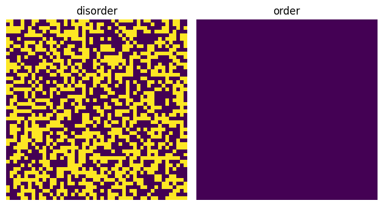
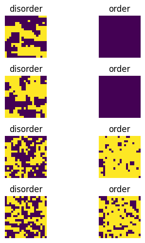
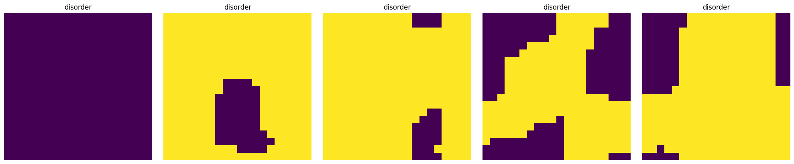
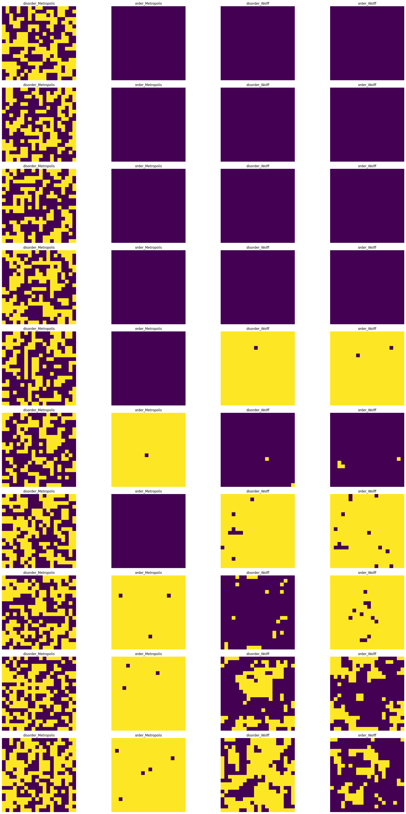
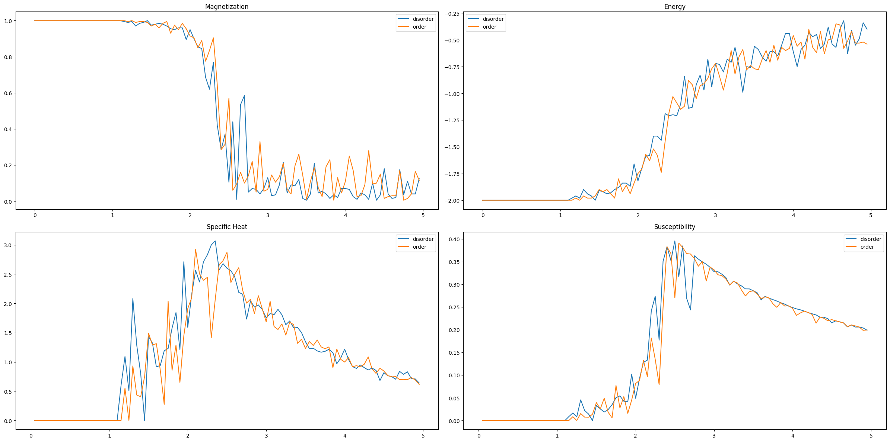
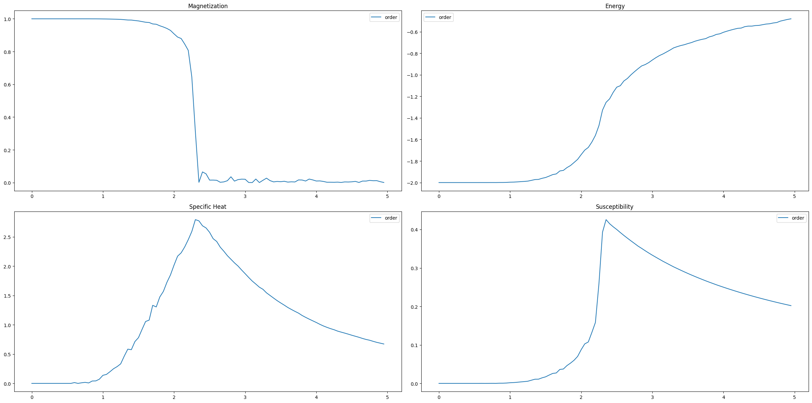

热统课上的一个作业,使用了Metropolis算法和Wolff算法模拟Ising模型

Ising Model的数值模拟
======


Ising模型简述
------
Ising模型是用来描述铁磁相变的一个著名的数学模型，也是最简单的复杂系统模型
每个格点具有一个自旋\\(\sigma\\),自旋之间的作用选取最紧邻的相互作用，相互作用强度使用\\(J\\)来表示，第二项中的\\(h\\)为外加磁场

$$H(\sigma)=-\sum_{<ij>}J_{ij}\sigma_i\sigma_j-\mu\sum_jh_j\sigma_j$$

为了研究体系的相变特征，我们对模型做出两个简化：
- 自旋相互作用大小相等设为\\(J\\)
- 没有外磁场的作用，即\\(h=0\\)
此时哈密顿量可以被写为

$$H(\sigma)=-J\sum_{<ij>}\sigma_i\sigma_j$$

由于Ising模型和其他几个常用的描述铁磁的模型在数学上的高度抽象，因此可以被广泛使用在各学科的复杂系统之中，例如可以使用两种自旋表示两种观点，外场和相互作用强度表示观点的宣传和相互之间的影响，以此来描述传播学中的复杂系统；还可以将两种自旋方向表示为神经元的两种状态来进行神经网络的构建等等。

由于Ising模型的解析求解比较困难（至今尚未有通用的三维伊辛模型解析解）但其结构由非常简单，因此我们常用蒙特卡洛算法对Ising模型进行建模（但其实实际开始模拟会发现一些问题不是那么简单）。

## 算法构建
### 初步思路
我们现在想要模拟这个体系，考虑到如果有N个格点，那么如果我们需要遍历每个格点需要做\\(2^N\\)次，同时每一步之后状态都需要更新，所以我们使用随机抽样的方法来解决这个问题。首先，我们肯定无法确定这个体系应该是什么样的（否则也不需要进行模拟了）因此初态只能是我们假设出来的一个东西，要达到真实状态需要根据初态和系统的能量进行更新，达到能量最低的状态——即末态。


```python
import numpy as np
import matplotlib.pyplot as plt
#首先定义初始化的场，并绘图查看，我们可以任意假设初始状态的磁场分布
#因此这里使用了完全随机和完全非随机的两个状态进行对比
def initial_disorder_spin_field(M,N):
    return np.random.choice([-1,1],size=(M,N))
def initial_order_spin_field(M,N):
    return np.ones((M,N))
plt.figure()
plt.subplot(1,2,1)
plt.imshow(initial_disorder_spin_field(50,50))
plt.title('disorder')
plt.axis('off')
plt.subplot(1,2,2)
plt.imshow(initial_order_spin_field(50,50))
plt.title('order')
plt.axis('off')
plt.tight_layout()
plt.show()
```


    

    


我们该如何进行自旋场的更新呢？一个最容易想到的办法就是：选取一个格点进行自旋翻转，如果体系能量更低了，那么就确认翻转，否则则不翻转。同时考虑到热涨落的因素，我们可以根据玻尔兹曼分布的特点增加涨落项，这个更新是一个Markov过程，由于热涨落，我们对于能量更高的状态也有一定的接受率\\(A\\)。

在这个过程中系统从\\(\mu\\)态转换到\\(\nu\\)的概率\\(P_{\mu\nu}\\)是恒定的，并且这个过程需要满足遍历性和平衡才能被没有问题的应用：
- 1、首先，一个遍历性的过程是指，无论从哪个状态开始，经过足够长的时间后，都有概率到达另一个状态
- 2、其次，两个状态之间的转换概率是相等的
$$P_{\mu}P_{\mu\nu}=P_{\nu}P_{\nu\mu}$$

对于单粒子翻转我们有：

$$P_\mu P_{\mu\nu}=P_\nu P_{\nu\mu}\quad\left(\frac{P_{\mu\nu}}{P_{\nu\mu}}=\frac{P_\mu}{P_\nu}\right)$$

由于系统属于Boltzman系统，所以我们有\\(P_{\mu_{i}}=\mathrm{e}^{-\beta\mu_{i}}/Z\\)，\\(P_{\mu_i\mu_j}\\)是系统从\\(\mu_i\\)到\\(\mu_j\\)的概率，根据上面的式子，我们再定义一个在\\(\mu_i\\)直接到\\(\mu_j\\)的概率\\(g_{\mu_i\mu_j}\\)与\\(\mu_j\\)的接受概率\\(A_{\mu_i\mu_j}\\),因此我们得到：

$$\frac{P_{\mu\nu}}{P_{\nu\mu}}=\frac{g_{\mu\nu}A_{\mu\nu}}{g_{\nu\mu}A_{\nu\mu}}$$

更进一步我们得到
$$\frac{g_{\mu\nu}P_{\mu\nu}}{g_{\nu\mu}P_{\nu\mu}}=\frac{A_{\mu\nu}}{A_{\nu\mu}}=\frac{P_\mu}{P_\nu}=\mathrm{e}^{-\beta(E_\mu-E_\nu)}$$
至此我们可以得到：
$$\left.A(\Delta E)=\left\{\begin{matrix}1&\Delta E\leq0\\\mathrm{e}^{-\beta\Delta E}&\Delta E>0\end{matrix}\right.\right.$$
最终算法可以被描述为：
- 选取一个格点
- 将格点进行翻转，并计算\\(\Delta E\\).
- 如果\\(\Delta E< 0\\) 或 \\(\exp(\frac{-\Delta E}{k_B T})>\\)一个0-1之间的随机数
- 格点翻转，否则不变


```python
#计算单个格点翻转的能量差（也可以根据这个计算总能量）
def delta_energy(spin_field,i,j,M,N,H=0,J=1):
    '''
    spin_field:自旋场
    H:外磁场默认为0
    J:自旋相互作用，默认为1
    '''
    delta_E=2*J*spin_field[i,j]*(spin_field[(i-1)%M,j]+spin_field[(i+1)%M,j]
                                 +spin_field[i, (j-1)%N] + spin_field[i, (j+1)%N])+2*spin_field[i,j]*H
    return delta_E
#单粒子翻转算法，如果能量更小直接翻转，否则具有一定概率翻转
def metropolis_update(spin_field,T,k=1):
    '''
    T:温度
    k玻尔兹曼常数
    '''
    M,N=spin_field.shape
    i,j=np.random.randint(0,N),np.random.randint(0,M)
    delta_E=delta_energy(spin_field,i,j,M,N,H=0,J=1)
    #能量最低原理
    if delta_E<=0:
        spin_field[i,j]=-spin_field[i,j]
    #热涨落情况
    elif np.exp((-delta_E)/(k*(T+0.00000000000000001)))>np.random.rand():
        spin_field[i,j]=-spin_field[i,j]
    return spin_field

# 模拟形成最后的自旋场，可以根据这个自旋场计算各种物理量
def simulate_spin_field(spin_field,T,steps):
    '''
    Metropolis单粒子翻转算法
    '''
    for i in range(steps):
        spin_field=metropolis_update(spin_field,T)
    return spin_field


```

完成了自旋场的构建，我们开始基础的模拟末态的样子


```python
M,N=20,20
steps=1000
plt.figure()
plt.figure(figsize=(4,10))
for l in range(0,4):
    T=1.5*l
    spin_field_disorder=initial_disorder_spin_field(M,N)
    spin_field_order=initial_order_spin_field(M,N)
    plt.subplot(8,2,1+2*l)
    plt.imshow(simulate_spin_field(spin_field_disorder,T,steps))
    plt.title('disorder')
    plt.axis('off')
    plt.subplot(8,2,2+2*l)
    plt.imshow(simulate_spin_field(spin_field_order,T,steps))
    plt.title('order')
    plt.axis('off')
plt.tight_layout()
plt.show()
```    

## 算法改进
还没有开始计算各种性质，但是目前我们已经发现了问题：在较高温度两种初始状态可以收敛到同一状态（至少看起来是这样的），但是低温时似乎状态差别很大。并且，即使增加模拟的steps变化也不是太大（或许最终可以收敛到一个方向，但是计算成本无法接受）因此我们必须发现算法中的问题，并改进算法。我们选取更低的温度，看看disorder的初始状态会发生什么。
### 分析低温时disorder的结果


```python
M,N=20,20
steps=10000
plt.figure()
plt.figure(figsize=(24,4))
for l in range(0,5):
    T=0.1*l
    spin_field_disorder=initial_disorder_spin_field(M,N)
    spin_field_order=initial_order_spin_field(M,N)
    plt.subplot(1,6,l+1)
    plt.imshow(simulate_spin_field(spin_field_disorder,T,steps))
    plt.title('disorder')
    plt.axis('off')
plt.tight_layout()
plt.show()
```

    

  
### 算法的问题与改进
我们会发现这个结果和温度较高时的有很大的区别，系统确实演化了，但是为什么无法到达全部同向排列的稳态呢？从上面的图中可以观察到，系统演化会形成一个个很大的“块”，说明结果并不是杂乱的。进一步，如果对一个块中非边缘点选取进行翻转，加上低温时较少的热涨落，我们发现，系统状态不发生更新，所以如果没有选到边缘的点，这个系统的演化似乎“卡住了”。

发现了问题之后我们可以开始改进算法：为了防止上面这种情况发生，我们把相同的自旋连成一个cluster正在某种程度上就可以解决这个问题。我们选取cluster的生成方式（类似广度优先的遍历算法）：
- 选取一个格子
- 如果与边上的自旋状态相同，就有一定的概率\\(P_{add}\\)（联通
- 将经历过的格子标记为operated，将新加入的格子作为新的原点向外进行搜索
- 重复上述步骤，直到cluster中的格子全部被标记
- 再加上接受率看看是否翻转

开始寻找接受率\\(\frac{A_{\mu\nu}}{A_{\nu\mu}}=\frac{g_{\nu\mu}P_{\mu\nu}}{g_{\mu\nu}P_{\mu\nu}}\\)，考虑的是最近邻联通，我们有

$$\frac{g_{\mu\nu}}{g_{\nu\mu}}=\frac{(1-P_{\mathrm{add}})^m}{(1-P_{\mathrm{add}})^n}=(1-P_{\mathrm{add}})^{m-n}$$

更进一步我们有$$\frac{A_{\mu\nu}}{A_{\nu\mu}}=\frac{g_{\nu\mu}P_{\mu\nu}}{g_{\mu\nu}P_{\mu\nu}}=(1-P_{\mathrm{add}})^{n-m}\frac{P_{\mu\nu}}{P_{\nu\mu}}$$

同时，根据之前考虑单粒子翻转时的情况，我们得到了

$$\frac{P_{\mu\nu}}{P_{\nu\mu}}=\frac{P_{\nu}}{P_{\mu}}=\mathrm{e}^{-\beta\Delta E},\Delta E=2J(m-n)$$


至此，我们可以得到接受率为：
$$\frac{A_{\mu\nu}}{A_{\nu\mu}}=\left[\mathrm{e}^{2\beta J}(1-P_{add})\right]^{n-m}$$
直接取接受率为1，使问题最简化，也可以减少代码的复杂度（少一步判断），我们得到\\(P_{\mathrm{add}}=1-\mathrm{e}^{-2\beta J}\\)。

至此算法已经准备好了，可以开始代码实现


```python
import numpy as np
import matplotlib.pyplot as plt
#初始化自旋场
def initial_disorder_spin_field(M,N):
    return np.random.choice([-1,1],size=(M,N))
def initial_order_spin_field(M,N):
    return np.ones((M,N))


# 计算能量差
def delta_energy(spin_field, i, j, M, N, H=0, J=1):
    '''
    spin_field:自旋场
    H:外磁场
    J:自旋相互作用
    '''
    delta_E = 2 * J * spin_field[i, j] * (spin_field[(i - 1) % M, j] + spin_field[(i + 1) % M, j]
                                          + spin_field[i, (j - 1) % N] + spin_field[i, (j + 1) % N]) + 2 * spin_field[
                  i, j] * H
    return delta_E


# 单粒子翻转算法
def metropolis_update(spin_field, T, k=1):
    '''
    T:温度
    k玻尔兹曼常数
    '''
    M, N = spin_field.shape
    i, j = np.random.randint(0, N), np.random.randint(0, M)
    delta_E = delta_energy(spin_field, i, j, M, N, H=0, J=1)
    # 能量最低原理
    if delta_E <= 0:
        spin_field[i, j] = -spin_field[i, j]
    # 热涨落情况
    elif np.exp((-delta_E) / (k * (T + 0.00000000000000001))) > np.random.rand():
        spin_field[i, j] = -spin_field[i, j]
    return spin_field


# cluster翻转算法
def wolff_update(spin_field, T, J=1, k=1, ):
    '''
    T:温度
    k玻尔兹曼常数
    '''
    M, N = spin_field.shape
    i, j = np.random.randint(0, N), np.random.randint(0, M)
    P_add = 1 - np.exp(-2 * J / (k * (T + 0.00000000000000001)))
    stack = [(i, j)]
    cluster = {(i, j)}
    spin = spin_field[i, j]
    while stack:
        i, j = stack.pop()
        neighbors = [(i, (j + 1) % N), (i, (j - 1) % N), ((i + 1) % M, j), ((i - 1) % M, j)]
        for x_, y_ in neighbors:
            if spin_field[x_, y_] == spin and (x_, y_) not in cluster and np.random.rand() <= P_add:
                stack.append((x_, y_))
                cluster.add((x_, y_))

    for i, j in cluster:
        spin_field[i, j] = -spin_field[i, j]
    return spin_field


# 模拟形成最后的自旋场，可以根据这个自旋场计算各种物理量
def simulate_spin_field(spin_field, method, T, steps):
    '''
    Method:
    Metropolis单粒子翻转算法
    Wolff团簇翻转算法
    '''
    if method == 'Metropolis':
        for i in range(steps):
            spin_field = metropolis_update(spin_field, T)
    if method == 'Wolff':
        for i in range(steps):
            spin_field = wolff_update(spin_field, T)
    return spin_field
```


```python
M,N=20,20
steps=100
plt.figure()
plt.figure(figsize=(24,42))
for l in range(0,10):
    T=0.3*l
    spin_field_disorder=initial_disorder_spin_field(M,N)
    spin_field_order=initial_order_spin_field(M,N)
    method='Metropolis'
    plt.subplot(10,4,1+4*l)
    plt.imshow(simulate_spin_field(spin_field_disorder,method,T,steps))
    plt.title('disorder_Metropolis')
    plt.axis('off')
    plt.subplot(10,4,2+4*l)
    plt.imshow(simulate_spin_field(spin_field_order,method,T,steps))
    plt.title('order_Metropolis')
    plt.axis('off')
    method='Wolff'
    plt.subplot(10,4,3+4*l)
    plt.imshow(simulate_spin_field(spin_field_disorder,method,T,steps))
    plt.title('disorder_Wolff')
    plt.axis('off')
    plt.subplot(10,4,4+4*l)
    plt.imshow(simulate_spin_field(spin_field_order,method,T,steps))
    plt.title('order_Wolff')
    plt.axis('off')
plt.tight_layout()
plt.show()
```


    

    


可以发现使用Cluster得到的结果是正确的

## 性质计算
基于上面的模型我们可以计算磁场强度，能量，比热，磁化率等物理量


```python
#定义计算的函数
#开始使用训练好的模型计算一些物理量，首先是能量和磁场大小
def average_magnetization(spin_field):
    #由于我们关注的是大小，正负其实是等价的所以
    aver_magnetization=np.abs(np.mean(spin_field))
    return aver_magnetization
def total_energy(spin_field):
    energy=0
    N,M=spin_field.shape
    for i in range(N):
        for j in range(M):
            #计算能量，并且使用%N和%M给出周期性边界条件，可以模拟无限大体系，避免有限尺寸效应
            energy += -spin_field[i,j] * (spin_field[(i+1)%N, j] + spin_field[i,(j+1)%M])
    return energy
#给出磁化率和比热的计算
def specific_heat(spin_field,T,k=1):
    energy_sum=0
    energy_square_sum=0
    M,N=spin_field.shape

    # 计算能量的总和和能量的平方的总和
    for i in range(M):
        for j in range(N):
            #使用之前给的函数给出每一个点的能量
            delta_E=delta_energy(spin_field,i,j,M,N)
            energy_sum+=delta_E
            energy_square_sum +=delta_E**2
    average_energy=energy_sum/(M*N)
    average_energy_square=energy_square_sum/(M*N)
    specific_heat=(average_energy_square-average_energy**2)/(k*T**2)
    return specific_heat

def susceptibility(spin_field,T,k=1):
    magnetization_sum = 0
    magnetization_square_sum = 0
    M, N = spin_field.shape

    # 计算磁化强度的总和和磁化强度的平方的总和
    for i in range(M):
        for j in range(N):
            magnetization = spin_field[i, j]
            magnetization_sum += magnetization
            magnetization_square_sum += magnetization ** 2

    # 计算磁化强度
    average_magnetization = magnetization_sum / (M * N)
    average_magnetization_square = magnetization_square_sum / (M * N)
    susceptibility = (average_magnetization_square - average_magnetization ** 2) / (k * T)

    return susceptibility
```


```python
M,N=20,20
steps=100
method='Wolff'
Temp=np.linspace(0,5,100)
spin_field_disorder=initial_disorder_spin_field(M,N)
spin_field_order=initial_order_spin_field(M,N)
#磁场强度
magnetization_disorder=[]
magnetization_order=[]
#能量
energy_disorder=[]
energy_order=[]
#比热
specific_heat_disorder=[]
specific_heat_order=[]
#磁化率
susceptibility_disorder=[]
susceptibility_order=[]

Temp=[]
for l in range(100):
    T=0.05*l
    #训练模型
    spin_field_disorder=simulate_spin_field(spin_field_disorder,method,T,steps)
    spin_field_order=simulate_spin_field(spin_field_order,method,T,steps)
    #计算磁化强度
    average_magnetization_disorder=average_magnetization(spin_field_disorder)
    average_magnetization_order=average_magnetization(spin_field_order)
    #计算能量
    total_energy_disorder=total_energy(spin_field_disorder)
    total_energy_order=total_energy(spin_field_order)
    #计算比热
    specific_heat_disorder1=specific_heat(spin_field_disorder,T)
    specific_heat_order1=specific_heat(spin_field_order,T)
    #计算磁化率
    susceptibility_disorder1=susceptibility(spin_field_disorder,T)
    susceptibility_order1=susceptibility(spin_field_order,T)
    #把结果写入数组
    #磁场
    magnetization_disorder.append(average_magnetization_disorder)
    magnetization_order.append(average_magnetization_order)
    #能量
    energy_disorder.append(total_energy_disorder/(M*N))
    energy_order.append(total_energy_order/(M*N))
    #比热
    specific_heat_disorder.append(specific_heat_disorder1)
    specific_heat_order.append(specific_heat_order1)
    #磁化率
    susceptibility_disorder.append(susceptibility_disorder1)
    susceptibility_order.append(susceptibility_order1)
    Temp.append(T)

plt.figure(figsize=(24,12))
plt.subplot(2,2,1)
plt.plot(Temp,magnetization_disorder,label='disorder')
plt.plot(Temp,magnetization_order,label='order')
plt.title('Magnetization')
plt.legend()
plt.subplot(2,2,2)
plt.plot(Temp,energy_disorder,label='disorder')
plt.plot(Temp,energy_order,label='order')
plt.title('Energy')
plt.legend()
plt.subplot(2,2,3)
plt.plot(Temp,specific_heat_disorder,label='disorder')
plt.plot(Temp,specific_heat_order,label='order')
plt.title('Specific Heat')
plt.legend()
plt.subplot(2,2,4)
plt.plot(Temp,susceptibility_disorder,label='disorder')
plt.plot(Temp,susceptibility_order,label='order')
plt.title('Susceptibility')
plt.legend()
plt.tight_layout()
plt.show()
```


    


    

    


可以明显看出两种方式都可以计算出结果，并且基本相同，我们选用一种即可，但是计算过程较多，因此我们使用python的numba来进行加速得到最终的代码和计算结果


```python
# 总的代码为
import numpy as np
import matplotlib.pyplot as plt
from numba import jit
def initial_disorder_spin_field(M,N):
    return np.random.choice([-1,1],size=(M,N))
def initial_order_spin_field(M,N):
    return np.ones((M,N))


# 计算能量差
@jit(nopython=True)
def delta_energy(spin_field, i, j, M, N, H=0, J=1):
    '''
    spin_field:自旋场
    H:外磁场
    J:自旋相互作用
    '''
    delta_E = 2 * J * spin_field[i, j] * (spin_field[(i - 1) % M, j] + spin_field[(i + 1) % M, j]
                                          + spin_field[i, (j - 1) % N] + spin_field[i, (j + 1) % N]) + 2 * spin_field[i, j] * H
    return delta_E
# 单粒子翻转算法，如果能量更小直接翻转，否则具有一定概率翻转
@jit(nopython=True)
def metropolis_update(spin_field, T, k=1):
    '''
    T:温度
    k玻尔兹曼常数
    '''
    M, N = spin_field.shape
    i, j = np.random.randint(0, N), np.random.randint(0, M)
    delta_E = delta_energy(spin_field, i, j, M, N, H=0, J=1)

    if delta_E <= 0:
        spin_field[i, j] = -spin_field[i, j]
    elif np.exp((-delta_E) / (k * (T))) > np.random.rand():
        spin_field[i, j] = -spin_field[i, j]
    return spin_field
# cluster算法，一次性可以更新很多，类似于广度搜索算法，我们选取一个点，其实格点和自旋相同的就会有一定可能性放到一个cluster中，继续对新的格点进行操作，
# 一直到cluster不再增长，把周围的和本身一样的大部分挑出来一起旋转可以更快收敛
@jit(nopython=True)
def wolff_update(spin_field, T, J=1, k=1):
    '''
    T:温度
    k玻尔兹曼常数
    '''
    M, N = spin_field.shape
    i, j = np.random.randint(0, N), np.random.randint(0, M)
    P_add = 1 - np.exp(-2 * J / (k * (T)))
    stack = [(i, j)]
    cluster = {(i, j)}
    spin = spin_field[i, j]
    while stack:
        i, j = stack.pop()
        neighbors = [(i, (j + 1) % N), (i, (j - 1) % N), ((i + 1) % M, j), ((i - 1) % M, j)]
        for x_, y_ in neighbors:
            if spin_field[x_, y_] == spin and (x_, y_) not in cluster and np.random.rand() <= P_add:
                stack.append((x_, y_))
                cluster.add((x_, y_))
    for i, j in cluster:
        spin_field[i, j] = -spin_field[i, j]
    return spin_field


# 模拟形成最后的自旋场，可以根据这个自旋场计算各种物理量
def simulate_spin_field(spin_field, method, T, steps):
    '''
    Method:
    Metropolis单粒子翻转算法
    Wolff团簇翻转算法
    '''
    if method == 'Metropolis':
        for i in range(steps):
            spin_field = metropolis_update(spin_field, T)
    if method == 'Wolff':
        for i in range(steps):
            spin_field = wolff_update(spin_field, T)
    return spin_field
# 开始使用训练好的模型计算一些物理量，首先是能量和磁场大小
def average_magnetization(spin_field):
    # 由于我们关注的是大小，正负其实是等价的所以
    aver_magnetization = np.abs(np.mean(spin_field))
    return aver_magnetization

def total_energy(spin_field):
    energy = 0
    N, M = spin_field.shape
    for i in range(N):
        for j in range(M):
            # 计算能量，并且使用%N和%M给出周期性边界条件，可以模拟无限大体系，避免有限尺寸效应
            energy += -spin_field[i, j] * (spin_field[(i + 1) % N, j] + spin_field[i, (j + 1) % M])
    return energy


# 给出磁化率和比热的计算
@jit(nopython=True)
def specific_heat(spin_field, T, k=1):
    energy_sum = 0
    energy_square_sum = 0
    M, N = spin_field.shape

    for i in range(M):
        for j in range(N):
            delta_E = delta_energy(spin_field, i, j, M, N)
            energy_sum += delta_E
            energy_square_sum += delta_E ** 2
    average_energy = energy_sum / (M * N)
    average_energy_square = energy_square_sum / (M * N)
    specific_heat = (average_energy_square - average_energy ** 2) / (k * T ** 2)
    return specific_heat


@jit(nopython=True)
def susceptibility(spin_field, T, k=1):
    magnetization_sum = 0
    magnetization_square_sum = 0
    M, N = spin_field.shape

    for i in range(M):
        for j in range(N):
            magnetization = spin_field[i, j]
            magnetization_sum += magnetization
            magnetization_square_sum += magnetization ** 2

    average_magnetization = magnetization_sum / (M * N)
    average_magnetization_square = magnetization_square_sum / (M * N)
    susceptibility = (average_magnetization_square - average_magnetization ** 2) / (k * T)

    return susceptibility

M,N=256,256
steps=1024
method='Wolff'
Temp=np.linspace(0,5,100)
#spin_field_disorder=initial_disorder_spin_field(M,N)
spin_field_order=initial_order_spin_field(M,N)
#磁场强度
#magnetization_disorder=[]
magnetization_order=[]
#能量
#energy_disorder=[]
energy_order=[]
#比热
#specific_heat_disorder=[]
specific_heat_order=[]
#磁化率
#susceptibility_disorder=[]
susceptibility_order=[]

Temp=[]
for l in range(100):
    T=0.05*l+0.000001
    #训练模型
    #spin_field_disorder=simulate_spin_field(spin_field_disorder,method,T,steps)
    spin_field_order=simulate_spin_field(spin_field_order,method,T,steps)
    #计算磁化强度
    #average_magnetization_disorder=average_magnetization(spin_field_disorder)
    average_magnetization_order=average_magnetization(spin_field_order)
    #计算能量
    #total_energy_disorder=total_energy(spin_field_disorder)
    total_energy_order=total_energy(spin_field_order)
    #计算比热
    #specific_heat_disorder1=specific_heat(spin_field_disorder,T)
    specific_heat_order1=specific_heat(spin_field_order,T)
    #计算磁化率
    #susceptibility_disorder1=susceptibility(spin_field_disorder,T)
    susceptibility_order1=susceptibility(spin_field_order,T)
    #把结果写入数组
    #磁场
    #magnetization_disorder.append(average_magnetization_disorder)
    magnetization_order.append(average_magnetization_order)
    #能量
    #energy_disorder.append(total_energy_disorder/(M*N))
    energy_order.append(total_energy_order/(M*N))
    #比热
    #specific_heat_disorder.append(specific_heat_disorder1)
    specific_heat_order.append(specific_heat_order1)
    #磁化率
    #susceptibility_disorder.append(susceptibility_disorder1)
    susceptibility_order.append(susceptibility_order1)
    Temp.append(T)

plt.figure(figsize=(24,12))
plt.subplot(2,2,1)
#plt.plot(Temp,magnetization_disorder,label='disorder')
plt.plot(Temp,magnetization_order,label='order')
plt.title('Magnetization')
plt.legend()
plt.subplot(2,2,2)
#plt.plot(Temp,energy_disorder,label='disorder')
plt.plot(Temp,energy_order,label='order')
plt.title('Energy')
plt.legend()
plt.subplot(2,2,3)
#plt.plot(Temp,specific_heat_disorder,label='disorder')
plt.plot(Temp,specific_heat_order,label='order')
plt.title('Specific Heat')
plt.legend()
plt.subplot(2,2,4)
#plt.plot(Temp,susceptibility_disorder,label='disorder')
plt.plot(Temp,susceptibility_order,label='order')
plt.title('Susceptibility')
plt.legend()
plt.tight_layout()
plt.show()
```


    

    
文中的函数可以在[Ising模型构建及性质计算](ising_files/ising.py)中得到，还可以基于此计算其他的性质。

## 参考文献
1.[当蒙特卡罗方法遇见伊辛模型](https://zhuanlan.zhihu.com/p/42836754)


2.M. E. J. Newman and G. T. Barkema, Monte Carlo Methods in Statistic Physics
