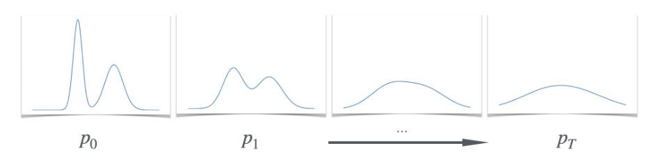
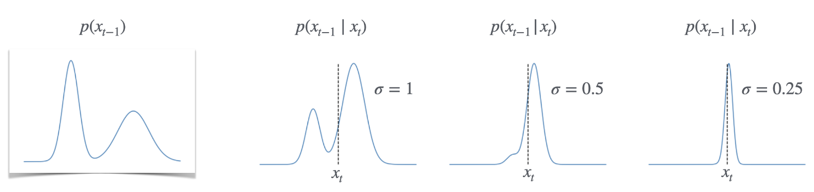

## 目录

- [目录](#目录)
- [1 扩散模型基础](#1-扩散模型基础)
  - [1.1 高斯噪声的添加](#11-高斯噪声的添加)
  - [1.2 抽象的扩散](#12-抽象的扩散)
  - [1.3 离散化](#13-离散化)
- [2 随机采样：DDPM](#2-随机采样ddpm)
  - [2.1 DDPM 的正确性](#21-ddpm-的正确性)

## 1 扩散模型基础

是生成模型的目标是：给定来自某些未知分布 $p(x)$ 的独立分布样本，构建一个（大致）相同分布的采样器。例如通过给定基础分布 $p_{dog}$ 的狗图像训练集，我们希望可以有一种方法生成新的狗图像。

一种思路是学习某个易于采样的分布（例如高斯噪声）到目标 $p$ 的变换。扩散模型的基本思路类似于一滴墨水滴入清水中的扩散及其逆过程，对于一滴墨水难以采样，但是扩散达到平衡态后形成均一的溶液，使采样变得简单。

### 1.1 高斯噪声的添加

对于高斯扩散，设 $x_0$ 是在 $\mathbb{R}^d$ 中按目标分布 $p$ 分布的随机变量。然后通过连续添加具有某些小尺度 $\sigma$ 的独立高斯噪声构造一系列随机变量 $x_1,x_2,\cdots,x_T$​:

$$\begin{equation}
    x_{t+1}:=x_t+\eta_t,\quad\eta_t\sim\mathcal{N}(0,\sigma^2)
\end{equation}$$

这被称为正向（forward）扩散过程，这个过程可以将给定数据分布转换为高斯噪声。方程(1)定义了一个关于所有${x_t}$的联合分布，并且我们令$\{p_t\}_{t\in[T]}$表示每个$x_t$的边缘分布（边缘分布：将联合概率分布投影到其组成随机变量之一的概率分布）。当步骤数$T$较大时，分布$p_T$与高斯分布接近，可以通过采样一个高斯分布来近似采样$p_T$。

现在我们可以考虑将问题转换成，给定一个$p_T$如何求得$p_{T-1}$，我们将其称为反向采样器(reverse sampler)，假设我们有一个可用的反向采样器，我们可以从$p_T$即简单的高斯分布开始，迭代应用，得到$p_{T-1},p_{T-2},\cdots p_0$。扩散模型的关键之处在于学习每个中间过程的反向过程比直接从目标分布中采样更容易，有许多种反向采样器的构建方法，我们下面以DDPM为例。

理想的 DDPM 采样器使用了一个简单的策略：在时间 $t$，给定输入$z$（从 $p_t$ 中采样的样本），我们输出从如下条件分布中采样的样本：

$$\begin{equation}
    p(x_{t-1}\mid x_t=z)
\end{equation}$$

这显然是一个正确的反向采样器。问题在于，它需要为每个 $x_t$ 学习条件分布 $p(x_{t−1} \vert  x_t)$ 的生成模型，这可能会很复杂。但是，如果每步的噪声 $\sigma$ 足够小，那么这个条件分布会变得简单：

**Fact1：(Diffusion Reverse Process)** 对于小的 $\sigma$ 和在（1）中定义的高斯扩散过程，条件分布 $p(x_{t−1} \vert  x_t)$  本身接近高斯分布。也就是说，对于所有时间 $t$ 和条件 $z ∈ \mathbb{R}^d$，存在一些均值参数 $\mu \in \mathbb{R}^d$  使得：

$$\begin{equation}
    p(x_{t-1}\mid x_{t}=z)\approx\mathcal{N}(x_{t-1}; \mu , \sigma^{2})
\end{equation}$$

这是一个nontrivial的结果，我们将在后面证明它，这个结果带来了一个重大的简化：我们不在需要从头开始学习任意分布$p(x_{t−1} \vert  x_t)$，我们现在对于这个分布除了均值都已经了解了，我们使用$\mu_{t-1}(x_t)$表示其均值（均值$μ_{t−1} : \mathbb{R}^d \rightarrow \mathbb{R}^d$，因为$p(x_{t−1} \vert  x_t)$的均值取决于时间$t$和条件$x_t$）。当$\sigma$足够小时，我们可以将后验分布近似为高斯分布，因此**只要得到条件分布的均值，就可以完整学习这个条件分布**。

学习 $p(x_{t−1} \vert  x_t)$ 的均值要比学习完整的条件分布简单得多，可以通过回归方法解决。具体而言，我们有一个联合分布 $(x_{t−1}, x_t)$，我们很容易可以从中采样，并且我们希望估计 $E[x_{t−1} \vert  x_t]$。这可以通过优化标准的回归损失来实现：

$$\begin{equation}
    \begin{aligned}
\mu_{t-1}(z)& :=\mathbb{E}[x_{t-1}\mid x_t=z] \\
\Longrightarrow\mu_{t-1}& =\underset{f:\mathbb{R}^d\to\mathbb{R}^d}{\operatorname*{argmin}}\quad\underset{x_t,x_{t-1}}{\operatorname*{E}}\vert \vert f(x_t)-x_{t-1}\vert \vert _2^2 \\
&=\underset{f:\mathbb{R}^d\to\mathbb{R}^d}{\operatorname*{argmin}}\underset{x_{t-1},\eta}{\operatorname*{\mathbb{E}}}\vert \vert f(x_{t-1}+\eta_t)-x_{t-1}\vert \vert _2^2,
\end{aligned}
\end{equation}$$

其中，期望是针对目标分布$p$中采样得到的样本$x_0$来说的，这个特定的回归问题在某些情况下已经被广泛研究。当目标$p$是图像分布时，对应的回归问题实际上是图像去噪的目标，可以使用CNN等方法处理。**我们已经将从任意分布中抽样学习的问题简化为了标准的回归问题**。

### 1.2 抽象的扩散

抽象地讨论高斯扩散之外的情况，定义类似的扩散模型，以便了解多种方法包括确定性采样器(deterministic samplers)，离散域(discrete domains)和流匹配(flow-matching)等。抽象来讲，构建类似的扩散生成模型的方法如下：从目标分布$p$开始，选择一些容易抽样的基础分布$q(x)$，例如高斯分布等，然后试图构建一些列在目标分布$p$和基础分布$q$之间的插值分布序列，也就是说，我们构建分布：

$$\begin{equation}
    p_0 , p_1 , p_2 , \ldots,p_T,
\end{equation}$$

$p_0=p$ 作为我们的目标分布，$p_T=q$ 作为基分布，并且相邻的分布 $(p_{t−1}, p_t)$ 在某种程度上，边际上是“接近的”，之后我们学习一个反向采样器，将分布$p_t$转换为$p_{t-1}$。如果相邻分布足够接近，即$\sigma$足够小，这一步骤会更加容易。

**Definition 1 (Reverse Sampler)** 给定一系列边际分布 $p_t$，第 $t$ 步的反向采样器是一个潜在的随机函数 $F_t$​，满足如果 $x_t∼p_t$，那么 $F_t(x_t)$ 的边际分布恰好是 $p_{t−1}$:

$$\begin{equation}
    \{F_t(z):z\sim p_t\}\equiv p_{t-1}
\end{equation}$$

存在很多可能得反向采样器，这些采样器并不依赖于高斯噪声，甚至不需要“添加噪声”的概念，我们可以在离散设置中将其实例化，其中我们考虑在有限集合上的分布$p$，并定义相应的插值分布和反向采样器。甚至我们可以构建具有确定性的反向采样器，在后面的部分我们将看到三种流行的采样器，DDPM，DDIM（确定性采样器）以及流匹配（可以视为DDIM的一般化）对于给定的一组边际分布$p_t$，存在许多可能得联合分布于这些边际分布一致。**因此对于给定的一组边际分布，没有一个标准的反向采样器**。

### 1.3 离散化

我们在进一步展开之前需要更精确说明相邻分布的“接近”概念，我们希望将序列$p_0,p_1,\cdots p_T$视为某种时间演化函数$p(x,t)$的离散化，该函数从$t=0$与目标分布$p_0$开始，到时间$t=1$与噪声分布$p_T$结束：

$$\begin{equation}
    p(x,k\Delta t)=p_k(x),\quad\mathrm{where~}\Delta t=\frac1T
\end{equation}$$

步数$T$控制离散化的精细度（相邻分布的“接近”程度），如果$T$足够大可以考虑连续时间极限。为了保证最终分布$p_T$的方差与离散化的步数无关，我们还需要具体的确定每个增量的方差：如果$x_k=x_{k-1}+\mathcal{N}(0,\sigma^2)$，那么，$x_T\sim\mathcal{N}(x_0,T\sigma^2)$。因此，我们需要通过$\Delta t=1/T$来放缩方差：

$$\begin{equation}
    \sigma=\sigma_q\sqrt{\Delta t}
\end{equation}$$

其中，$σ^2_q$是所需要的终端方差（terminal variance），这个选择确保了无论$T$如何选择，$p_T$的方差始终为$σ^2_q$。这种$\sqrt{\Delta t}$放缩在之后对反向求解器正确性的论证中将被证明是重要的，并且与SDE表述相关。

为了方便我们将调整符号，从现在开始，$t$将表示在区间$[0,1]$内的连续值（具体来说，取值为$0,\Delta t,2\Delta t,\cdots,T\Delta t=1$），下标将表示时间而非索引，例如$x_t$现在表示在离散时间$t$的$x$，方程（1）变为：

$$\begin{equation}
    x_{t+\Delta t}:=x_t+\eta_t,\quad\eta_t\sim\mathcal{N}(0,\sigma_q^2\Delta t)
\end{equation}$$

因此有：

$$\begin{equation}
    x_t\sim\mathcal{N}(x_0,\sigma_t^2),\quad\mathrm{where~}\sigma_t:=\sigma_q\sqrt{t}
\end{equation}$$

因为到时间 $t$ 时添加的总噪声：$\sum_{\tau\in\{0,\Delta t,2\Delta t,...,t-\Delta t\}}\eta_\tau $，是一个均值为$0$，方差为 $\sum_\tau\sigma_q^2\Delta t=\sigma_q^2t$ 的高斯分布。

## 2 随机采样：DDPM

在这一节中，回顾了在前面讨论的类似DDPM的反向采样器，并证明其正确性。这个采样器在概念上与Ho 等人（2020年）在去噪扩散概率模型（DDPM）中推广的采样器相同，最初由 Sohl-Dickstein 等人（2015年）引入。相较于Ho等人的工作，这一节中的技术细节略有不同，主要区别在于使用了“方差爆炸（Variance Exploding）” 的扩散前向过程，还使用了一个恒定的噪声计划，并且没有讨论如何参数化预测器（“预测 $x_0 \text{~vs.~} x_{t−1} \text{~vs.~} \text{noise~} \eta$”）

我们考虑1.3中的设计，其中有一个目标分布$p$，以及由方程定义的噪声联合分布$(x_0, x_{\Delta t},...,x_1​)$,DDPM采样器需要估计下面的条件期望：

$$\begin{equation}
    \mu_t(z):=\mathbb{E}[x_t\mid x_{t+\Delta t}=z]
\end{equation}$$

 对于每个时间步 $t\in{0,\Delta t,...,1−\Delta t}$都有一个$\{μ_t\}$。在训练阶段，我们通过优化如下去噪回归目标来从 $x_0 $的独立同分布样本估计这些函数：

$$\begin{equation}
    \mu_t=\underset{f:\mathbb{R}^d\to\mathbb{R}^d}{\operatorname*{argmin}}\underset{x_t,x_{t+\Delta t}}{\operatorname*{\mathbb{E}}}\vert \vert f(x_{t+\Delta t})-x_t\vert \vert _2^2
\end{equation}$$

通常使用参数化$f$的神经网络，在使用中，通常会共享参数来学习不同的回归函数$\{μ_t\}$，而不是独立为每个时间步学习单独的函数，通常训练一个模型$f_{\theta}$，该模型接受时间$t$作为额外参数，并且满足$f_{\theta}(x_t,t)=\mu_t(x_t)$来实现。在推理阶段，我们使用估计的函数来实现反向采样器：

**Algorithm 1**: Stochastic Reverse Sampler (DDPM-like)，对于输入样本和时间$x_t,t$，有

$$\widehat{x}_{t-\Delta t}\leftarrow\mu_{t-\Delta t}(x_t)+\mathcal{N}(0,\sigma_q^2\Delta t)$$

实际生成样本需要从各向同性的高斯分布中采样$x_1\sim\mathcal{N}(0,\sigma_q^2)$，然后运行 **Algorithm 1** 迭代直到$t=0$以生成样本$x_0$

我们想推理这个过程的正确性：为什么迭代算法**Algorithm 1**可以近似生成一个来自目标分布$p$的样本？我们需要证明某种形式的**Fact 1**，即真实条件分布$p(x_{t-\Delta t}\vert  x_t)$可以很好近似为高斯分布，并且随着$\Delta t \rightarrow 0$这种近似会更加准确。

### 2.1 DDPM 的正确性

对**Fact1**进行更精确的推导，完成对**Algorithm 1**的正确性的论证——即它在**Definition 1** 的意义下近似于一个有效的反向抽样器。

**Claim 1** (Informal) 设 $p_{t−Δt}$(x) 是任意充分平滑的 $\mathbb{R}^d$ 上的密度。考虑 $(x_{t−Δt}, x_t)$ 的联合分布，其中$x_{t-\Delta t}~\sim~p_{t-\Delta t}$且$x_t~\sim~x_{t-\Delta t}+\mathcal{N}(0,\sigma_q^2\Delta t)$。那么，对于足够小的 $\Delta t$，以下成立。对于所有的条件 $z\in \mathbb{R}^d$，存在 $\mu_z$ 使得：

$$\begin{equation}
    p(x_{t-\Delta t}\mid x_{t}=z)\approx\mathcal{N}(x_{t-\Delta t}; \mu_{z} , \sigma_{q}^{2}\Delta t)
\end{equation}$$

其中 $\mu_z$ 是仅依赖于 $z$ 的某个常数。此外，仅需

$$\begin{equation}
    \begin{aligned}\mu_{z}&:=\mathbb{E}_{(x_{t-\Delta t},x_t)}[x_{t-\Delta t}\mid x_t=z]\\&=z+(\sigma_q^2\Delta t)\nabla\log p_t(z),\end{aligned}
\end{equation}$$

其中，$p_t$ 是 $x_t$ 的边际分布。

在推导之前，需要主义几点：**Claim 1**意味着，要从$x_{t−Δt}$ 抽样，只需首先从$x_t$ 抽样，然后从以 $\mathbb{E}[x_{t-\Delta t}\mid x_t]$为中心的高斯分布抽样。这正是 DDPM所做的。我们实际上不需要方程中的$\mu_z$ 的表达式；我们只需知道这样的 $\mu_z$存在，因此我们可以从样本中学习它。

**Claim 1**(Informal)的证明：这里是为什么分数出现在反向过程中的启发性论证。我们基本上只需应用贝叶斯规则，然后适当地进行泰勒展开。我们从贝叶斯规则开始：

$$\begin{equation}
    p(x_{t-\Delta t}\vert x_t)=p(x_t\vert x_{t-\Delta t})p_{t-\Delta t}(x_{t-\Delta t})/p_t(x_t)
\end{equation}$$ 