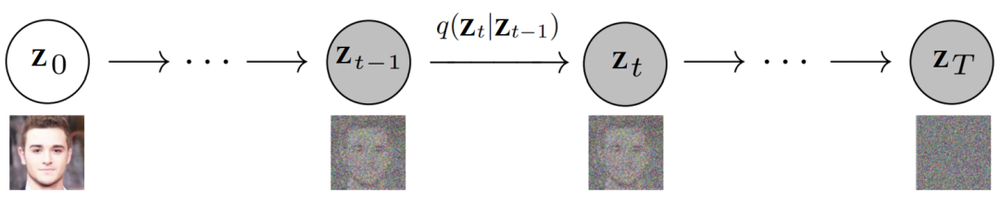
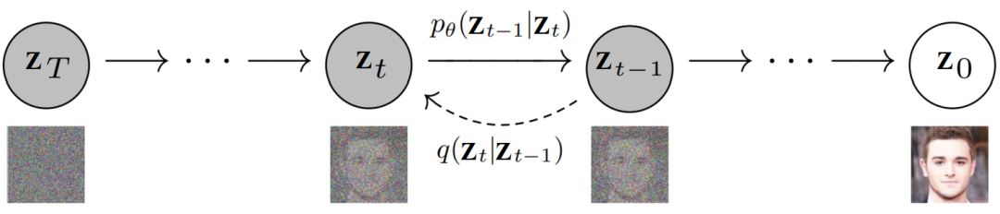

# Diffusion Model
## 什么是生成模型和扩散模型
给定观测样本\\(x\\),生成模型的目标是学习建模其真实数据分布\\(p(x)\\)。我们可以从我们的近似模型中任意生成新的样本。此外，我们还可以使用学习到的模型来评估观测或采样数据的可能性。

 
扩散模型将真实样本扩散到一个简单分布，再从简单分布中采样生成新的样本，模型学习目标是数据的分布，从复杂分布扩散到简单分布，再从简单分布逐步生成复杂分布。

扩散模型的思路来源于“扩散”的物理过程，扩散的结果是呈现熵最大的平衡状态。回顾墨水滴入水杯的过程，如果要在初始态找到某个小体积内的墨水分子密度或者其他信息，是非常复杂的状态，而扩散之后分布均匀的平衡态则比较容易表述。扩散过程是机械的，所以在逻辑上我们也可以想象这个过程的逆过程（只是在真实物理情况下不会发生），这个逆过程可以实现把简单的均已分布的体系转换成复杂的初始状态。

扩散模型的思路是把复杂图像转换成简单噪声，再让模型学习如何实现逆过程把噪声转换为图像。从这个过程中可以看出，扩散的过程是固定的，不需要学习的，但逆过程则是学习的重点。

## ELBO, VAE, 与 Hierarchical VAE
可以认为需要处理的数据是由一个相关的看不见的潜变量表征或生成的（类似隐马尔科夫模型HMM），我们可以用随机变量\\(z\\)表示。回想柏拉图的《洞穴寓言》，一群人被困在洞穴中只能看见投影在墙上的阴影（二维），这些阴影的来源是火光和三维物体。我们遇到的对象也可能是某种更高维度的函数生成的，函数里面封装了各种抽象属性，我们观察到的东西是这个函数（或者说概念集合）的三维投影；洞穴人无法完全理解三维的物体，但他们可以对二维阴影进行推理，同理我们可以近似描述我们观测数据的潜在表征（函数）。

柏拉图的寓言是为了解释潜在的，不可观测的观念或者概念，这决定了我们的观察，但在生成模型中我们通常学习低维的表征而不是高维的潜在表征。这是因为没有在强先验的情况下学习比观察维度更高的函数（表征）是无用的；同时，学习低维的也可以看做是压缩的形式，可以潜在地发现描述一些结构。

### Evidence Lower Bound
我们可以将隐变量和我们观察到的数据想象成一个联合分布\\(p(x,z)\\)。回想一下生成式建模的一种方法，称为"似然法”, 学习模型，使所有观测\\(x\\)的似然\\(p(x)\\)最大化。我们有两种方法可以对这个联合分布操作来恢复纯观测数据\\(p(\boldsymbol{x})\\)；我们可以使用积分将潜变量\\(z\\)消去：

$$p(\boldsymbol{x})=\int p(\boldsymbol{x},\boldsymbol{z})dz$$

还可以使用另外一种方式：

$$p(\boldsymbol{x})=\frac{p(\boldsymbol{x},\boldsymbol{z})}{p(\boldsymbol{z}|\boldsymbol{x})}$$

直接计算最大化似然\\(p(x)\\)需要在第一个公式中找出所有的隐变量进行积分，或者在第二个公式中找到真实的隐编码器，即公式中的下半部分。但是利用这两个公式可以推导出一个证据下界Evidence Lower Bound（ELBO），证据被量化为观测数据的对数似然。然后最大化RLBO成为优化隐变量模型的目标。最好的情况下，ELBO被完美参数化和优化的时候，就等于证据。

$$\begin{aligned}
\log p(\boldsymbol{x})& =\log\int p(\boldsymbol{x},\boldsymbol{z})d\boldsymbol{z}  \\
&=\log\int\frac{p(\boldsymbol{x},\boldsymbol{z})q_\phi(\boldsymbol{z}|\boldsymbol{x})}{q_\phi(\boldsymbol{z}|\boldsymbol{x})}d\boldsymbol{z} \\
&=\log\mathbb{E}_{q_\phi(z|\boldsymbol{x})}\left[\frac{p(\boldsymbol{x},\boldsymbol{z})}{q_\phi(\boldsymbol{z}|\boldsymbol{x})}\right]
\end{aligned}$$

利用琴生不等式可以得到：

$$\log p(\boldsymbol{x})\geq\mathbb{E}_{q_\phi(\boldsymbol{z}|\boldsymbol{x})}\left[\log\frac{p(\boldsymbol{x},\boldsymbol{z})}{q_\phi(\boldsymbol{z}|\boldsymbol{x})}\right]$$

\\(q_{\phi}\\)是寻求优化的参数为\\(\phi\\)的近似变分分布，可以被认为是一个可参数化的模型，用来估计给定观测值在隐变量上的真实分布，寻求逼近真实后验\\(p\\)，我们通过调节参数来增加下界最大化ELBO，可以获得用于真实数据分布的组件并从中采样，进而学习生成模型。

### Variational Autoencoders
变分自编码器（VAE）是使用ELBO的一种trick

### Hierarchical Variational Autoencoders
Hierarchical Variational Autoencoder（HVAE）是对变分自编码器（VAE）的推广，扩展到多个隐变量的层级结构。在这种形式下，隐变量本身被解释为由其他更高级、更抽象的隐变量生成。直观地说，就像我们将三维观察对象视为由一个更高级的抽象潜在变量生成一样，柏拉图洞穴中的人们将三维对象视为生成他们的二维观察结果的潜在变量。因此，从柏拉图洞穴居民的角度来看，他们的观察结果可以被理解为由一个两层或更多层的潜在层级的模型来进行建模。

虽然在一般 HVAE 中，每个隐变量都可以以所有先前的隐变量为条件，但在这里我们重点关注一种特殊情况，称为马尔科夫HVAE，即MHVAE。在 MHVAE 中，生成过程是一个马尔科夫链；其中解码每个隐变量仅以先前的隐变量为条件。

这可以看作是简单地将 VAE 堆叠在一起，如上图所示。在数学上，我们将马尔可夫分层变分自编码器的联合分布表示为：

$$p(\mathbf{x},\mathbf{z}_{1:T})=p(\mathbf{z}_T)p_{\boldsymbol{\theta}}(\mathbf{x}\mid\mathbf{z}_1)\prod_{t=2}^Tp_{\boldsymbol{\theta}}(\mathbf{z}_{t-1}\mid\mathbf{z}_t)$$

其后验为

$$q_\phi(\mathbf{z}_{1:T}\mid\mathbf{x})=q_\phi(\mathbf{z}_1\mid\mathbf{x})\prod_{t=2}^Tq_\phi(\mathbf{z}_t\mid\mathbf{z}_{t-1})$$

将式联合分布和后验分布代入ELBO以生成替代形式

$$\mathbb{E}_{q_\phi(\mathbf{z}_{1:T}|\mathbf{x})}\left[\log\frac{p(\mathbf{x},\mathbf{z}_{1:T})}{q_\phi(\mathbf{z}_{1:T}\mid\mathbf{x})}\right]=\mathbb{E}_{q_\phi(\mathbf{z}_{1:T}|\mathbf{x})}\left[\log\frac{p(\mathbf{z}_T)p_{\boldsymbol{\theta}(\mathbf{x}\mid\mathbf{z}_1)}\prod_{t=2}^Tp_{\boldsymbol{\theta}(\mathbf{z}_{t-1}\mid\mathbf{z}_t)}}{q_\phi(\mathbf{z}_1\mid\mathbf{x})\prod_{t=2}^Tq_{\boldsymbol{\phi}}(\mathbf{z}_t\mid\mathbf{z}_{t-1})}\right]$$
## 扩散模型
### 前向扩散过程
前向扩散过程对应如下马尔科夫链

$$\mathbf{z}_0\rightarrow\mathbf{z}_1\rightarrow\mathbf{z}_2\rightarrow\cdots\rightarrow\mathbf{z}_T$$

具体来说，前向扩散过程中的分布\\(q\\)定义为一个马尔可夫链，如下所示

$$q(\mathbf{z}_1,\ldots,\mathbf{z}_T\mid\mathbf{z}_0)=\prod_{t=1}^Tq(\mathbf{z}_t\mid\mathbf{z}_{t-1})$$

右边单独的一项被称为前向扩散核（FDK），不像在 VAE 中那样需要学习参数，扩散模型（如 DDPM）中采用高斯分布

$$q(\mathbf{z}_t\mid\mathbf{z}_{t-1})=\mathcal{N}\Big(\mathbf{z}_t;\sqrt{1-\beta_t}\mathbf{z}_{t-1},\beta_t\mathbf{I}\Big)$$

### 反向扩散过程
反向扩散过程，即生成过程，是逆方向上的一个马尔科夫链

需要学习的是反向扩散核（RDK）

$$p_{\boldsymbol{\theta}}(\mathbf{z}_{\boldsymbol{t}-1}\mid\mathbf{z}_{\boldsymbol{t}})$$

### 损失函数
在 ELBO 的推导中的关键项。对于任意复杂的马尔可夫 HVAE 中的任意后验，涉及到的 KL 散度项

$$\mathcal{D}_{\mathbb{KL}}(q(\mathbf{z}_{t-1}\mid\mathbf{z}_t,\mathbf{z}_0)\mid\mid p_{\boldsymbol{\theta}}(\mathbf{z}_{t-1}\mid\mathbf{z}_t))$$

很难最小化，但在扩散模型中，可以利用高斯转移这个假设来使优化变得容易处理。最终可以得到损失函数为：

$$\begin{aligned}
&\underset{\theta}{\operatorname*{\arg\min}}\mathcal{D}_{\mathbb{KL}}(q(\mathbf{z}_{t-1}\mid\mathbf{z}_t,\mathbf{z}_0)\mid\mid p_{\boldsymbol{\theta}}(\mathbf{z}_{t-1}\mid\mathbf{z}_t)) \\
&=\underset{\theta}{\operatorname*{\arg\min}}\mathcal{D}_{\mathbb{K}\mathbb{L}}\left(\mathcal{N}(\mathbf{z}_{t-1};\boldsymbol{\mu}_q,\boldsymbol{\Sigma}_q(t))\mid\mid\mathcal{N}(\mathbf{z}_{t-1};\boldsymbol{\mu}_{\boldsymbol{\theta}},\boldsymbol{\Sigma}_q(t))\right) \\
&=\arg\min_{\boldsymbol{\theta}}\frac1{2\sigma_q^2(t)}\frac{\bar{\alpha}_{t-1}(1-\alpha_t)^2}{(1-\bar{\alpha}_t)^2}\big[\|\hat{\mathbf{z}}_{\boldsymbol{\theta}}(\mathbf{z}_t,t)-\mathbf{z}_0\|_2^2\big]
\end{aligned}$$
